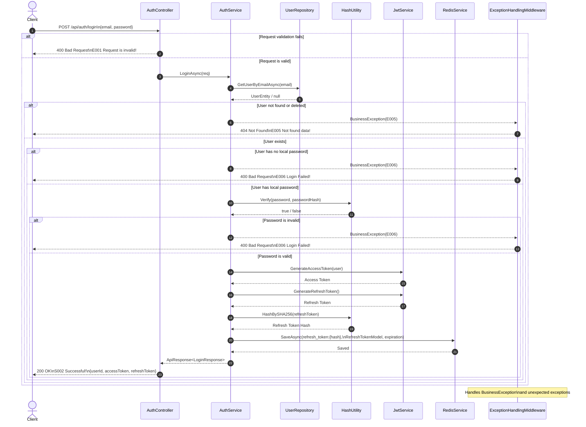
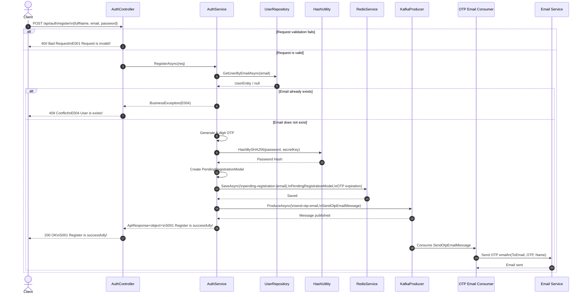
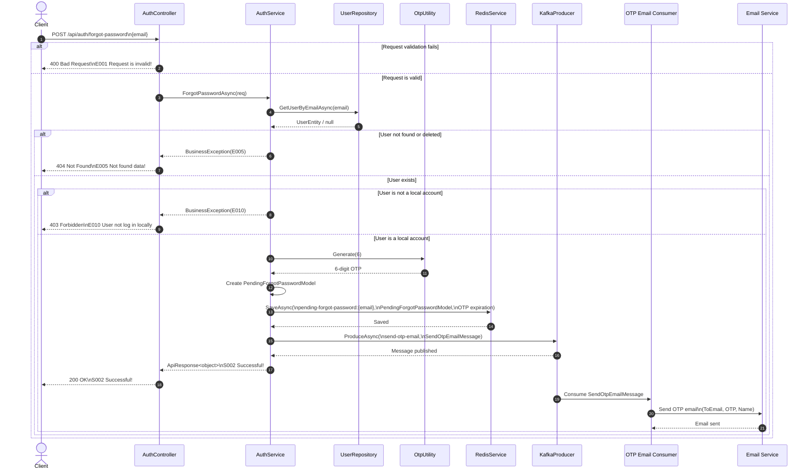
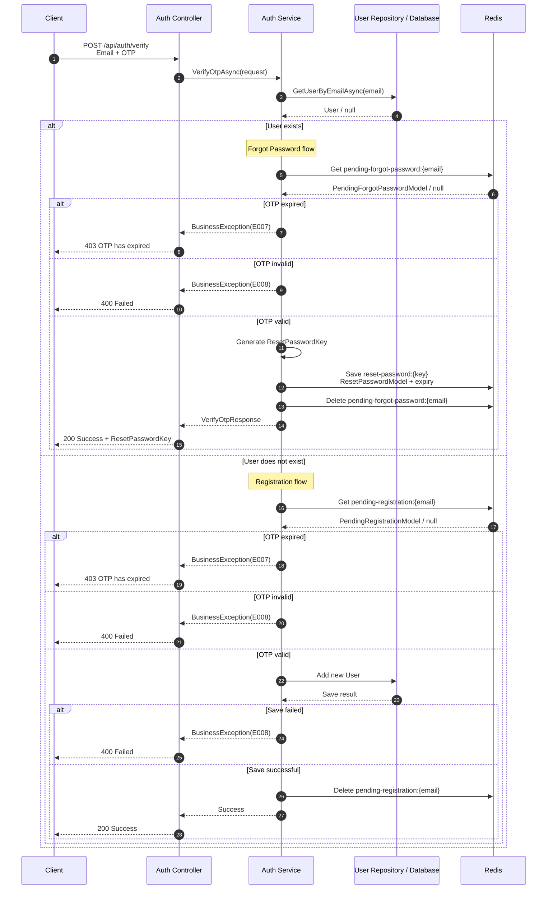
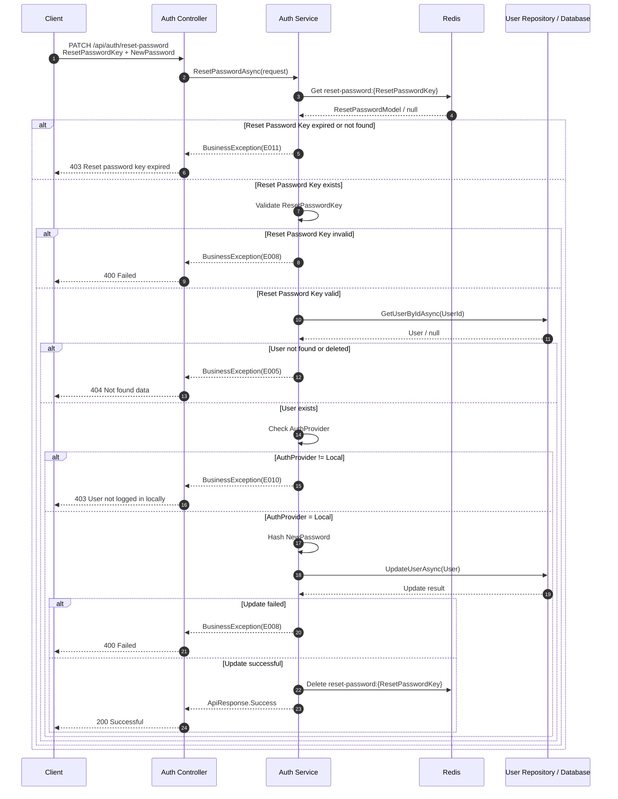
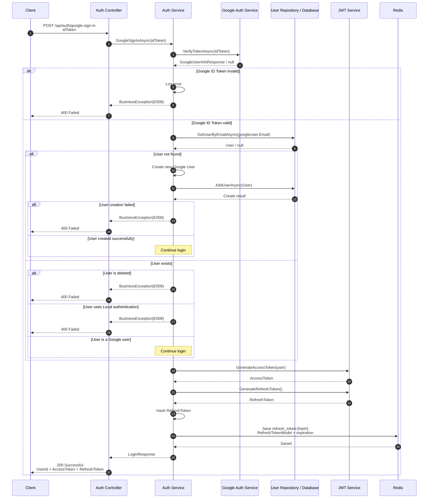
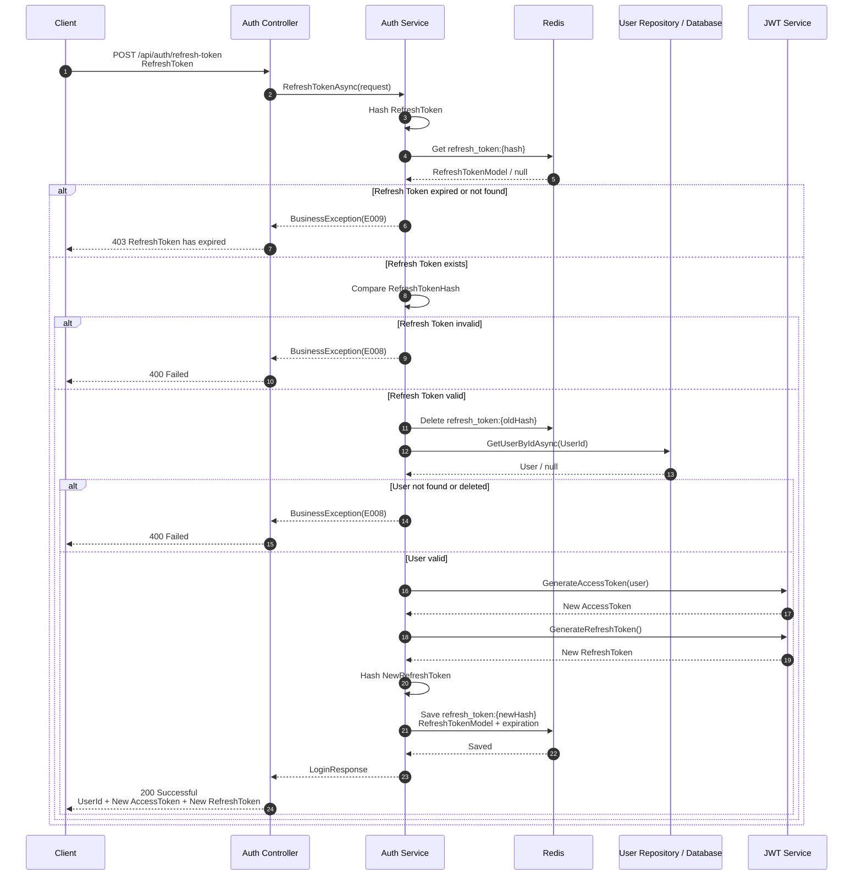

# Application Programming Interface Description

# Table of Contents

- [1. Auth](#1-auth)
  - [1.1. Login](#11-login)
  - [1.2. Register](#12-register)
  - [1.3. Forgot Password](#13-forgot-password)
  - [1.4. Verify OTP](#14-verify-otp)
  - [1.5. Reset Password](#15-reset-password)
  - [1.6. Google Login](#16-google-login)
  - [1.7. Refresh Token](#17-refresh-token)

## 1. Auth
### 1.1. Login

#### API Information

| Item             | Description                                                                                                            |
| ---------------- | ---------------------------------------------------------------------------------------------------------------------- |
| **API**          | `POST https://<host>:<port>/api/auth/login`                                                                            |
| **Content-Type** | `application/json`                                                                                                     |
| **Purpose**      | Authenticate a user using email and password, then issue an access token and refresh token for authenticated requests. |

#### Request

The API receives the user's email and password in the request body.

```json
{
    "email": "user@example.com",
    "password": "Password@123"
}
```

**Input fields:**

| Field      | Type     | Required | Description                                                                                                                                                               |
| ---------- | -------- | -------- | ------------------------------------------------------------------------------------------------------------------------------------------------------------------------- |
| `email`    | `string` | Yes      | User's email address. Maximum 255 characters and must have a valid email format.                                                                                          |
| `password` | `string` | Yes      | User's password. Must be 6–15 characters, contain at least one uppercase letter, one lowercase letter, one digit, and one special character, and must not contain spaces. |

The request is validated before the controller processes the login operation. If validation fails, the API returns `E001 - Request is invalid!`.

#### Processing

After successful request validation, the API performs the following operations:

1. Find the user by email.
2. Check whether the user exists and is not deleted.
3. Check whether the user has a local password.
4. Verify the provided password against the stored password hash.
5. Generate an access token.
6. Generate a refresh token.
7. Hash the refresh token and store its information in Redis with an expiration time.
8. Return the user's ID together with the access token and refresh token.

#### Response

When login is successful, the API returns HTTP `200 OK` with response code `S002`.

```json
{
    "isSuccess": true,
    "responseCode": "S002",
    "message": "Successful!",
    "httpStatus": 200,
    "data": {
        "userId": "7f2c4a1e-5d2a-4d9a-b4f1-123456789abc",
        "accessToken": "<access-token>",
        "refreshToken": "<refresh-token>"
    }
}
```

**Output fields:**

| Field          | Type     | Description                                                                    |
| -------------- | -------- | ------------------------------------------------------------------------------ |
| `userId`       | `Guid`   | Unique identifier of the authenticated user.                                   |
| `accessToken`  | `string` | JWT access token used to authenticate protected API requests.                  |
| `refreshToken` | `string` | Refresh token used to obtain a new access token when the access token expires. |

#### Error Responses

| Response Code | HTTP Status | Condition                                                         |
| ------------- | ----------: | ----------------------------------------------------------------- |
| `E001`        |       `400` | Request validation fails.                                         |
| `E005`        |       `404` | User does not exist or the user has been deleted.                 |
| `E006`        |       `400` | Password is incorrect or the user does not have a local password. |
| `E002`        |       `500` | An unexpected internal server error occurs.                       |

#### Sequence Diagram



#### Purpose

The Login API is responsible for authenticating a user and establishing an authenticated session. A successful login provides:

* **Access Token**: used to access protected APIs.
* **Refresh Token**: used to refresh authentication when the access token expires.
* **Redis storage**: stores the hashed refresh token and its associated user information until the configured refresh-token expiration time.

### 1.2. Register

#### API Information

| Item             | Description                                                                                                                                                        |
| ---------------- | ------------------------------------------------------------------------------------------------------------------------------------------------------------------ |
| **API**          | `POST https://<host>:<port>/api/auth/register`                                                                                                                     |
| **Content-Type** | `application/json`                                                                                                                                                 |
| **Purpose**      | Register a new user by validating the registration information, creating a temporary registration record, and sending an OTP to the user's email for verification. |

#### Request

The API receives the user's full name, email, and password in the request body.

```json
{
    "fullName": "Nguyen Van A",
    "email": "user@example.com",
    "password": "Password@123"
}
```

**Input fields:**

| Field      | Type     | Required | Description                                                                                                                                                               |
| ---------- | -------- | -------- | ------------------------------------------------------------------------------------------------------------------------------------------------------------------------- |
| `fullName` | `string` | Yes      | User's full name. Maximum 255 characters.                                                                                                                                 |
| `email`    | `string` | Yes      | User's email address. Maximum 255 characters and must have a valid email format.                                                                                          |
| `password` | `string` | Yes      | User's password. Must be 6–15 characters, contain at least one uppercase letter, one lowercase letter, one digit, and one special character, and must not contain spaces. |

The request is validated before the controller processes the registration operation. If validation fails, the API returns `E001 - Request is invalid!`.

#### Processing

After successful request validation, the API performs the following operations:

1. Check whether the email already exists in the database.
2. If the email already exists, return `E004 - User is exists!`.
3. Generate a 6-digit OTP.
4. Hash the user's password using SHA-256 with the configured secret key.
5. Create a temporary `PendingRegistrationModel` containing the full name, email, password hash, and OTP.
6. Store the pending registration information in Redis using the key:
   `pending-registration:{email}`.
7. Set the Redis expiration time according to `OtpExpirySeconds`.
8. Publish a `SendOtpEmailMessage` to the Kafka topic `send-otp-email`.
9. The email consumer can then process the message and send the OTP to the user.
10. Return a successful registration response.

#### Response

When the registration request is accepted successfully, the API returns HTTP `200 OK` with response code `S001`.

```json
{
    "isSuccess": true,
    "responseCode": "S001",
    "message": "Register is successfully!",
    "httpStatus": 200,
    "data": null
}
```

The API does not return user information or the OTP in the response. The OTP is sent to the user's email through the asynchronous Kafka-based email process.

#### Output fields

| Field          | Type            | Description                                                                              |
| -------------- | --------------- | ---------------------------------------------------------------------------------------- |
| `isSuccess`    | `boolean`       | Indicates whether the request was processed successfully.                                |
| `responseCode` | `string`        | Application-specific response code. `S001` indicates successful registration initiation. |
| `message`      | `string`        | Result message returned by the API.                                                      |
| `httpStatus`   | `integer`       | HTTP status code of the response.                                                        |
| `data`         | `object / null` | No additional data is returned for this API.                                             |

#### Error Responses

| Response Code | HTTP Status | Condition                                   |
| ------------- | ----------: | ------------------------------------------- |
| `E001`        |       `400` | Request validation fails.                   |
| `E004`        |       `409` | The email is already registered.            |
| `E002`        |       `500` | An unexpected internal server error occurs. |

#### Sequence Diagram



#### Purpose

The Register API starts the user registration process without immediately creating the user as a verified account.

The API uses **Redis** to temporarily store the registration information and OTP with an expiration time. **Kafka** is used to publish an email-sending message asynchronously, allowing the API to return the registration result without waiting for the email to be sent.

The registration flow can therefore be summarized as:

```text
Client
  ↓
Register API
  ↓
Check existing email
  ↓
Generate OTP + Hash password
  ↓
Store pending registration in Redis
  ↓
Publish OTP email message to Kafka
  ↓
Return success response
  ↓
Kafka Consumer
  ↓
Send OTP email
```

### 1.3. Forgot Password

#### API Information

| Item             | Description                                                                                                                                                                 |
| ---------------- | --------------------------------------------------------------------------------------------------------------------------------------------------------------------------- |
| **API**          | `POST https://<host>:<port>/api/auth/forgot-password`                                                                                                                       |
| **Content-Type** | `application/json`                                                                                                                                                          |
| **Purpose**      | Start the password recovery process by generating an OTP, temporarily storing the OTP and user information in Redis, and sending the OTP to the user's email through Kafka. |

#### Request

The API receives the user's email address in the request body.

```json
{
    "email": "user@example.com"
}
```

**Input fields:**

| Field   | Type     | Required | Description                                                                      |
| ------- | -------- | -------- | -------------------------------------------------------------------------------- |
| `email` | `string` | Yes      | User's email address. Maximum 255 characters and must have a valid email format. |

The request is validated before the controller processes the forgot-password operation. If validation fails, the API returns `E001 - Request is invalid!`.

#### Processing

After successful request validation, the API performs the following operations:

1. Find the user by email.
2. Check whether the user exists and is not deleted.
3. Check whether the user's authentication provider is `Local`.
4. Generate a 6-digit OTP.
5. Create a temporary `PendingForgotPasswordModel` containing the user's ID and OTP.
6. Store the pending forgot-password information in Redis using the key:
   `pending-forgot-password:{email}`.
7. Set the Redis expiration time according to `OtpExpirySeconds`.
8. Publish a `SendOtpEmailMessage` to the Kafka topic `send-otp-email`.
9. The OTP email consumer processes the message and sends the OTP to the user's email.
10. Return a successful response to the client.

#### Response

When the forgot-password request is processed successfully, the API returns HTTP `200 OK` with response code `S002`.

```json
{
    "isSuccess": true,
    "responseCode": "S002",
    "message": "Successful!",
    "httpStatus": 200,
    "data": null
}
```

The API does not return the OTP or any sensitive user information in the response. The OTP is sent to the user's email through the asynchronous email-processing flow.

#### Output fields

| Field          | Type            | Description                                                                 |
| -------------- | --------------- | --------------------------------------------------------------------------- |
| `isSuccess`    | `boolean`       | Indicates whether the request was processed successfully.                   |
| `responseCode` | `string`        | Application-specific response code. `S002` indicates successful processing. |
| `message`      | `string`        | Result message returned by the API.                                         |
| `httpStatus`   | `integer`       | HTTP status code of the response.                                           |
| `data`         | `object / null` | No additional data is returned for this API.                                |

#### Error Responses

| Response Code | HTTP Status | Condition                                                                                                |
| ------------- | ----------: | -------------------------------------------------------------------------------------------------------- |
| `E001`        |       `400` | Request validation fails.                                                                                |
| `E005`        |       `404` | User does not exist or the user has been deleted.                                                        |
| `E010`        |       `403` | The user is not registered as a local account and therefore cannot reset the password through this flow. |
| `E002`        |       `500` | An unexpected internal server error occurs.                                                              |

#### Sequence Diagram



#### Purpose

The Forgot Password API starts the password reset process for users with a local account.

The API uses **Redis** as temporary storage for the OTP and user ID. The stored information expires automatically according to the configured OTP expiration time. **Kafka** is used to send the email request asynchronously so that the API does not need to wait for the email service to finish sending the OTP.

The forgot-password flow can be summarized as:

```text
Client
  ↓
Forgot Password API
  ↓
Find user by email
  ↓
Check local account
  ↓
Generate OTP
  ↓
Store OTP + UserId in Redis
  ↓
Publish OTP email message to Kafka
  ↓
Return success response
  ↓
Kafka Consumer
  ↓
Send OTP email
  ↓
User receives OTP
```

The OTP generated by this API is intended to be verified by the subsequent **Verify OTP** API before the user is allowed to reset the password.

### 1.4. Verify OTP

**API format:** `POST https://<host>:<port>/api/auth/verify`

**Content-Type:** `application/json`

#### Description

The Verify OTP API is used to verify a user's 6-digit OTP code sent to their email. The API supports two flows:

* **Registration:** verifies the OTP stored in the pending registration data in Redis and creates a new user account.
* **Forgot Password:** verifies the OTP stored in Redis and generates a temporary `ResetPasswordKey` that is used to access the Reset Password API.

The API determines which flow to execute based on whether the email already belongs to an existing user.

#### Input

**Request body:**

```json
{
  "email": "user@example.com",
  "otp": "123456"
}
```

| Field   | Type   | Required | Description                                                                     |
| ------- | ------ | -------- | ------------------------------------------------------------------------------- |
| `email` | string | Yes      | User's email address. Must be a valid email and must not exceed 255 characters. |
| `otp`   | string | Yes      | OTP code. Must contain exactly 6 digits.                                        |

**Validation rules:**

* `Email` is required.
* `Email` must be in a valid email format.
* `Email` must not exceed 255 characters.
* `Otp` is required.
* `Otp` must contain exactly 6 digits.

#### Output

##### Registration flow

When the email does not belong to an existing user and the OTP is valid, the system creates the user successfully.

```json
{
  "isSuccess": true,
  "responseCode": "S002",
  "message": "Successful!",
  "httpStatus": 200,
  "data": null
}
```

##### Forgot Password flow

When the email belongs to an existing user and the OTP is valid, the system generates a `ResetPasswordKey`.

```json
{
  "isSuccess": true,
  "responseCode": "S002",
  "message": "Successful!",
  "httpStatus": 200,
  "data": {
    "resetPasswordKey": "7f3b2c1e-8f42-4e6a-9e9f-123456789abc",
    "action": "ForgotPassword"
  }
}
```

The generated `ResetPasswordKey` is temporarily stored in Redis and must be used by the Reset Password API before it expires.

#### Error Responses

| Response Code | HTTP Status | Description                                                |
| ------------- | ----------: | ---------------------------------------------------------- |
| `E001`        |         400 | Request validation failed.                                 |
| `E007`        |         403 | OTP has expired or the OTP data no longer exists in Redis. |
| `E008`        |         400 | OTP is invalid or the verification process failed.         |
| `E002`        |         500 | Internal server error.                                     |

##### Example: Invalid OTP

```json
{
  "isSuccess": false,
  "responseCode": "E008",
  "message": "Failed!",
  "httpStatus": 400,
  "data": null
}
```

##### Example: Expired OTP

```json
{
  "isSuccess": false,
  "responseCode": "E007",
  "message": "OTP has expired!",
  "httpStatus": 403,
  "data": null
}
```

#### Purpose

The purpose of this API is to:

1. Verify that the OTP entered by the user matches the OTP stored in Redis.
2. Complete the account registration process after successful OTP verification.
3. Authorize the password reset process by generating a temporary `ResetPasswordKey`.
4. Remove the OTP-related data from Redis after successful verification.

#### Sequence Diagram



### 1.5. Reset Password

**API format:** `PATCH https://<host>:<port>/api/auth/reset-password`

**Content-Type:** `application/json`

#### Description

The Reset Password API is used to change the password of a user after the Forgot Password process has been successfully verified through OTP.

The API receives a temporary `ResetPasswordKey` generated by the Verify OTP API together with the user's new password. The system verifies the key stored in Redis, retrieves the corresponding user, checks that the user uses local authentication, updates the password, and removes the reset password key from Redis after a successful password change.

#### Input

**Request body:**

```json
{
  "resetPasswordKey": "7f3b2c1e-8f42-4e6a-9e9f-123456789abc",
  "newPassword": "NewPass@123"
}
```

| Field              | Type   | Required | Description                                                |
| ------------------ | ------ | -------- | ---------------------------------------------------------- |
| `resetPasswordKey` | GUID   | Yes      | Temporary key generated after successful OTP verification. |
| `newPassword`      | string | Yes      | New password of the user.                                  |

**Password validation rules:**

* Must contain between **6 and 15 characters**.
* Must contain at least **one uppercase letter**.
* Must contain at least **one lowercase letter**.
* Must contain at least **one digit**.
* Must contain at least **one special character**.
* Must not contain spaces.

#### Output

When the password is changed successfully, the API returns:

```json
{
  "isSuccess": true,
  "responseCode": "S002",
  "message": "Successful!",
  "httpStatus": 200,
  "data": null
}
```

The `data` field is `null` because the API does not return any additional data after the password has been successfully updated.

#### Error Responses

| Response Code | HTTP Status | Description                                                   |
| ------------- | ----------: | ------------------------------------------------------------- |
| `E001`        |         400 | Request validation failed.                                    |
| `E002`        |         500 | Internal server error.                                        |
| `E005`        |         404 | User was not found or has been deleted.                       |
| `E008`        |         400 | Reset password operation failed.                              |
| `E010`        |         403 | The user does not use local authentication.                   |
| `E011`        |         403 | The reset password key has expired or is no longer available. |

##### Example: Reset Password Key Expired

```json
{
  "isSuccess": false,
  "responseCode": "E011",
  "message": "Your time to change the password has expired!",
  "httpStatus": 403,
  "data": null
}
```

##### Example: User Not Found

```json
{
  "isSuccess": false,
  "responseCode": "E005",
  "message": "Not found data!",
  "httpStatus": 404,
  "data": null
}
```

##### Example: User Does Not Use Local Authentication

```json
{
  "isSuccess": false,
  "responseCode": "E010",
  "message": "User not log in locally",
  "httpStatus": 403,
  "data": null
}
```

#### Purpose

The purpose of this API is to:

1. Verify that the `ResetPasswordKey` is valid and has not expired.
2. Identify the user associated with the reset password request.
3. Ensure that the user uses local authentication before allowing the password to be changed.
4. Hash and update the user's new password.
5. Delete the used `ResetPasswordKey` from Redis to prevent it from being reused.

#### Sequence Diagram



#### Reset Password Flow

```text
Forgot Password
      │
      ▼
Enter Email
      │
      ▼
Receive OTP
      │
      ▼
Verify OTP
      │
      ▼
Generate ResetPasswordKey
      │
      ▼
Reset Password API
      │
      ├── Validate ResetPasswordKey
      ├── Find User
      ├── Check Local Authentication
      ├── Hash New Password
      ├── Update Password
      └── Delete ResetPasswordKey
      │
      ▼
Password Reset Successfully
```
### 1.6. Google Login

**API format:** `POST https://<host>:<port>/api/auth/google-sign-in?idToken=<google-id-token>`

**Content-Type:** `application/json`

> The `idToken` is currently passed as a query parameter through `[FromQuery]`, so the request does not contain a JSON request body.

#### Description

The Google Login API allows users to authenticate using their Google account. The API receives a Google ID token, verifies the token with the Google authentication service, and retrieves the user's Google account information.

If the email associated with the Google account does not exist in the system, a new user is automatically created with `Google` as the authentication provider.

After successful authentication, the API generates an access token and a refresh token. The refresh token is hashed and stored in Redis for subsequent token refresh operations.

#### Input

**Query parameter:**

```text
idToken=<Google ID Token>
```

| Parameter | Type   | Required | Description                                                                      |
| --------- | ------ | -------- | -------------------------------------------------------------------------------- |
| `idToken` | string | Yes      | Google ID token obtained from the client after successful Google authentication. |

**Example request:**

```http
POST https://localhost:7064/api/auth/google-sign-in?idToken=eyJhbGciOiJSUzI1NiIs...
Content-Type: application/json
```

#### Output

When Google authentication is successful, the API returns the user's ID, access token, and refresh token.

```json id="s8f4v2"
{
  "isSuccess": true,
  "responseCode": "S002",
  "message": "Successful!",
  "httpStatus": 200,
  "data": {
    "userId": "7f3b2c1e-8f42-4e6a-9e9f-123456789abc",
    "accessToken": "eyJhbGciOiJIUzI1NiIs...",
    "refreshToken": "X3hK9mL2pQ7v..."
  }
}
```

| Field          | Type   | Description                                                                    |
| -------------- | ------ | ------------------------------------------------------------------------------ |
| `userId`       | GUID   | Unique identifier of the authenticated user.                                   |
| `accessToken`  | string | JWT access token used to access protected APIs.                                |
| `refreshToken` | string | Refresh token used to obtain a new access token when the access token expires. |

#### User Creation

When the Google email does not exist in the database, the API automatically creates a new user with:

* `Email` = Google account email
* `FullName` = Google account name
* `AvatarUrl` = Google account avatar
* `AuthProvider` = `Google`

The newly created user is then authenticated normally and receives an access token and refresh token.

#### Error Responses

| Response Code | HTTP Status | Description                                                                          |
| ------------- | ----------: | ------------------------------------------------------------------------------------ |
| `E001`        |         400 | Request is invalid.                                                                  |
| `E002`        |         500 | Internal server error.                                                               |
| `E008`        |         400 | Google login failed or an operation failed.                                          |
| `E009`        |         403 | Refresh token has expired. *(Used by refresh-token flow, not directly by this API.)* |

##### Example: Invalid Google ID Token

```json id="9m2w7k"
{
  "isSuccess": false,
  "responseCode": "E008",
  "message": "Failed!",
  "httpStatus": 400,
  "data": null
}
```

##### Example: Deleted User

```json id="4j7p1c"
{
  "isSuccess": false,
  "responseCode": "E008",
  "message": "Failed!",
  "httpStatus": 400,
  "data": null
}
```

##### Example: Local Account Uses the Same Email

```json id="q2v8nd"
{
  "isSuccess": false,
  "responseCode": "E008",
  "message": "Failed!",
  "httpStatus": 400,
  "data": null
}
```

#### Purpose

The purpose of this API is to:

1. Authenticate users through their Google account.
2. Verify the authenticity of the Google ID token.
3. Automatically create a new Google-authenticated user when the email does not exist.
4. Prevent deleted users from signing in.
5. Prevent a local-authentication account from signing in through Google.
6. Generate an access token and refresh token after successful authentication.
7. Store the hashed refresh token in Redis for secure token management.

#### Sequence Diagram



#### Authentication Flow

```text
Google Account
      │
      ▼
Google Authentication
      │
      ▼
Receive Google ID Token
      │
      ▼
POST /api/auth/google-sign-in
      │
      ▼
Verify Google ID Token
      │
      ├── Invalid → Return E008
      │
      ▼
Find User by Email
      │
      ├── Not found → Create Google User
      │
      ├── Deleted → Return E008
      │
      ├── Local account → Return E008
      │
      ▼
Generate Access Token
      │
      ▼
Generate Refresh Token
      │
      ▼
Hash Refresh Token
      │
      ▼
Store Refresh Token in Redis
      │
      ▼
Return LoginResponse
```

### 1.7. Refresh Token

**API format:** `POST https://<host>:<port>/api/auth/refresh-token`

**Content-Type:** `application/json`

#### Description

The Refresh Token API is used to obtain a new access token when the current access token has expired or is about to expire.

The client sends a valid refresh token to the API. The system hashes the received refresh token and uses the hash to locate the corresponding refresh token record in Redis.

If the refresh token is valid, the existing refresh token is deleted and a new access token and refresh token are generated. The new refresh token is hashed and stored in Redis with a new expiration time.

This implementation uses **refresh token rotation**, meaning that each successful refresh invalidates the old refresh token and replaces it with a new one.

#### Input

**Request body:**

```json
{
  "refreshToken": "X3hK9mL2pQ7v..."
}
```

| Field          | Type   | Required | Description                                                       |
| -------------- | ------ | -------- | ----------------------------------------------------------------- |
| `refreshToken` | string | Yes      | Refresh token previously issued by the Login or Google Login API. |

#### Output

When the refresh token is valid, the API returns a new access token and a new refresh token.

```json
{
  "isSuccess": true,
  "responseCode": "S002",
  "message": "Successful!",
  "httpStatus": 200,
  "data": {
    "userId": "7f3b2c1e-8f42-4e6a-9e9f-123456789abc",
    "accessToken": "eyJhbGciOiJIUzI1NiIs...",
    "refreshToken": "Y8mP2kL7qR4x..."
  }
}
```

| Field          | Type   | Description                                                        |
| -------------- | ------ | ------------------------------------------------------------------ |
| `userId`       | GUID   | Unique identifier of the authenticated user.                       |
| `accessToken`  | string | Newly generated JWT access token.                                  |
| `refreshToken` | string | Newly generated refresh token that replaces the old refresh token. |

#### Error Responses

| Response Code | HTTP Status | Description                                               |
| ------------- | ----------: | --------------------------------------------------------- |
| `E001`        |         400 | Request validation failed.                                |
| `E002`        |         500 | Internal server error.                                    |
| `E008`        |         400 | Refresh token is invalid or the refresh operation failed. |
| `E009`        |         403 | Refresh token has expired or is no longer available.      |

##### Example: Refresh Token Expired

```json
{
  "isSuccess": false,
  "responseCode": "E009",
  "message": "RefreshToken has expired!",
  "httpStatus": 403,
  "data": null
}
```

##### Example: Invalid Refresh Token

```json
{
  "isSuccess": false,
  "responseCode": "E008",
  "message": "Failed!",
  "httpStatus": 400,
  "data": null
}
```

#### Purpose

The purpose of this API is to:

1. Validate the refresh token submitted by the client.
2. Retrieve the associated user from Redis and the database.
3. Generate a new access token without requiring the user to log in again.
4. Generate a new refresh token for continued authentication.
5. Rotate the refresh token by deleting the old token.
6. Store the new refresh token hash in Redis with its expiration time.

#### Refresh Token Rotation

The refresh process follows a token rotation mechanism:

```text
Old Refresh Token
        │
        ▼
Hash Refresh Token
        │
        ▼
Find Token Hash in Redis
        │
        ├── Not found → E009 RefreshToken Expired
        │
        ▼
Delete Old Refresh Token
        │
        ▼
Find User
        │
        ├── User invalid/deleted → E008 Failed
        │
        ▼
Generate New Access Token
        │
        ▼
Generate New Refresh Token
        │
        ▼
Hash New Refresh Token
        │
        ▼
Store New Refresh Token in Redis
        │
        ▼
Return New Tokens
```

#### Sequence Diagram



