# Mô tả Entity Relationship Diagram (ERD)

## 1. Tổng quan

ERD của hệ thống **Book Shop — Nền tảng bán sách trực tuyến** mô hình hóa các thực thể dữ liệu chính và mối quan hệ giữa chúng nhằm hỗ trợ các nghiệp vụ quản lý tài khoản, sách, danh mục, giỏ hàng, đặt hàng, thanh toán, tồn kho, cửa hàng, khuyến mãi, đánh giá, trả hàng, hoàn tiền và thông báo.

Thiết kế dữ liệu được chia thành các nhóm chính:

- **User / Account:** `USER`, `ADDRESS`
- **Product / Category:** `BOOK`, `CATEGORY`, `BOOK_CATEGORY`
- **Store / Inventory:** `STORE`, `STORE_MANAGER`, `INVENTORY`, `INVENTORY_TRANSACTION`
- **Shopping Cart:** `CART`, `CART_ITEM`
- **Promotion:** `PROMOTION`, `PROMOTION_BOOK`, `PROMOTION_CATEGORY`, `PROMOTION_USAGE`
- **Order / Payment / Shipment:** `ORDER`, `ORDER_ITEM`, `PAYMENT`, `SHIPMENT`
- **Review:** `REVIEW`
- **Return / Refund:** `RETURN_REQUEST`, `RETURN_ITEM`, `REFUND`
- **Notification:** `NOTIFICATION`

ERD phản ánh các yêu cầu dữ liệu trong SRS, trong đó đơn hàng phải lưu thông tin khách hàng, sản phẩm, số lượng, giá, khuyến mãi, tổng tiền, địa chỉ giao hàng, phương thức thanh toán, trạng thái đơn hàng và thông tin giao hàng.

```mermaid
erDiagram

    USER {
        varchar(30) id PK
        varchar(255) email UK
        varchar(255) password_hash
        varchar(10) auth_provider
        varchar(255) name
        text avatar_url
        int role
        boolean enable
        timestamp created_at
        timestamp updated_at
        boolean is_deleted
    }

    ADDRESS {
        varchar(30) id PK
        varchar(30) user_id FK
        varchar(255) recipient_name
        varchar(11) phone
        varchar(500) address_line
        varchar(50) ward
        varchar(50) district
        varchar(50) city
        varchar(50) province
        boolean is_default
        timestamp created_at
        timestamp updated_at
        boolean is_deleted
    }

    CATEGORY {
        varchar(30) id PK
        varchar(30) parent_id FK
        varchar(255) name
        boolean is_active
        timestamp created_at
        timestamp updated_at
        boolean is_deleted
    }

    BOOK {
        varchar(30) id PK
        varchar(255) author
        varchar(255) publisher
        varchar(500) name
        text description
        decimal price
        varchar image_url
        int status
        timestamp created_at
        timestamp updated_at
        boolean is_deleted
    }

    BOOK_CATEGORY {
        varchar(30) book_id PK, FK
        varchar(30) category_id PK, FK
        timestamp created_at
        timestamp updated_at
        boolean is_deleted
    }

    STORE {
        varchar(30) id PK
        varchar(500) name
        varchar(255) address
        varchar(11) phone
        boolean is_active
        timestamp created_at
        timestamp updated_at
        boolean is_deleted
    }

    STORE_MANAGER {
        varchar(30) user_id PK, FK
        varchar(30) store_id PK, FK
        timestamp created_at
        timestamp updated_at
        boolean is_deleted
    }

    INVENTORY {
        varchar(30) id PK
        varchar(30) store_id FK
        varchar(30) book_id FK
        int quantity
        int reserved_quantity
        int available_quantity
        int damaged_quantity
        int incoming_quantity
        timestamp created_at
        timestamp updated_at
        boolean is_deleted
    }

    INVENTORY_TRANSACTION {
        varchar(30) id PK
        varchar(30) inventory_id FK
        varchar(30) user_id FK
        varchar transaction_type
        int quantity
        int quantity_before
        int quantity_after
        text reason
        int reference_type
        varchar(30) reference_id
        timestamp created_at
        timestamp updated_at
        boolean is_deleted
    }

    CART {
        varchar(30) id PK
        varchar(30) user_id FK
        timestamp created_at
        timestamp updated_at
        boolean is_deleted
    }

    CART_ITEM {
        varchar(30) id PK
        varchar(30) cart_id FK
        varchar(30) book_id FK
        int quantity
        decimal unit_price
        timestamp created_at
        timestamp updated_at
        boolean is_deleted
    }

    PROMOTION {
        varchar(30) id PK
        varchar(6) code UK
        varchar(200) name
        int promotion_type
        decimal discount_value
        decimal min_order_value
        timestamp start_at
        timestamp end_at
        int usage_limit
        int usage_count
        boolean free_shipping
        boolean is_active
        timestamp created_at
        timestamp updated_at
        boolean is_deleted
    }

    PROMOTION_BOOK {
        varchar(30) promotion_id PK, FK
        varchar(30) book_id PK, FK
        timestamp created_at
        timestamp updated_at
        boolean is_deleted
    }

    PROMOTION_CATEGORY {
        varchar(30) promotion_id PK, FK
        varchar(30) category_id PK, FK
        timestamp created_at
        timestamp updated_at
        boolean is_deleted
    }

    PROMOTION_USAGE {
        varchar(30) id PK
        varchar(30) promotion_id FK
        varchar(30) user_id FK
        varchar(30) order_id FK
        timestamp created_at
        timestamp updated_at
        boolean is_deleted
    }

    ORDER {
        varchar(30) id PK
        varchar(30) user_id FK
        varchar(30) address_id FK
        varchar order_code UK
        decimal subtotal
        decimal discount_amount
        decimal shipping_fee
        decimal total_amount
        int payment_method
        int payment_status
        int order_status
        int shipping_status
        timestamp ordered_at
        timestamp completed_at
        timestamp cancelled_at
        timestamp created_at
        timestamp updated_at
        boolean is_deleted
    }

    ORDER_ITEM {
        varchar(30) id PK
        varchar(30) order_id FK
        varchar(30) book_id FK
        int quantity
        decimal unit_price
        decimal discount_amount
        decimal total_price
    }

    PAYMENT {
        varchar(30) id PK
        varchar(30) order_id FK
        int payment_method
        decimal amount
        int status
        timestamp paid_at
        timestamp created_at
        timestamp updated_at
        boolean is_deleted
    }

    SHIPMENT {
        varchar(30) id PK
        varchar(30) order_id FK
        varchar(500) provider
        varchar(50) tracking_code
        int status
        timestamp shipped_at
        timestamp delivered_at
        timestamp created_at
        timestamp updated_at
        boolean is_deleted
    }

    REVIEW {
        varchar(30) id PK
        varchar(30) user_id FK
        varchar(30) book_id FK
        varchar(30) order_id FK
        int rating
        text comment
        varchar moderation_status
        timestamp created_at
        timestamp updated_at
        boolean is_deleted
    }

    RETURN_REQUEST {
        varchar(30) id PK
        varchar(30) order_id FK
        varchar(30) user_id FK
        text evidence
        varchar(255) bank_account_name
        varchar(255) bank_account_number
        varchar(255) bank_name
        int status
        text reason
        timestamp requested_at
        timestamp approved_at
        timestamp rejected_at
        timestamp completed_at
    }

    RETURN_ITEM {
        varchar(30) id PK
        varchar(30) return_request_id FK
        varchar(30) order_item_id FK
        int quantity
    }

    REFUND {
        varchar(30) id PK
        varchar(30) return_request_id FK
        varchar(30) order_id FK
        decimal refund_amount
        int refund_method
        int status
        timestamp refunded_at
        timestamp created_at
    }

    NOTIFICATION {
        varchar(30) id PK
        varchar(30) user_id FK
        int type
        varchar(500) title
        text content
        varchar channel
        boolean is_read
        timestamp sent_at
        timestamp created_at
        timestamp updated_at
        boolean is_deleted
    }

    %% =========================
    %% USER / ACCOUNT
    %% =========================

    USER ||--o{ ADDRESS : has

    USER ||--o| CART : owns

    USER ||--o{ ORDER : places

    USER ||--o{ REVIEW : writes

    USER ||--o{ NOTIFICATION : receives

    USER ||--o{ RETURN_REQUEST : creates

    USER ||--o{ INVENTORY_TRANSACTION : performs

    %% =========================
    %% BOOK / PRODUCT
    %% =========================

    BOOK ||--o{ BOOK_CATEGORY : belongs_to
    CATEGORY ||--o{ BOOK_CATEGORY : contains

    CATEGORY ||--o| CATEGORY : parent_of

    %% =========================
    %% STORE / INVENTORY
    %% =========================

    USER ||--o{ STORE_MANAGER : manages
    STORE ||--o{ STORE_MANAGER : assigned_to

    STORE ||--o{ INVENTORY : contains

    BOOK ||--o{ INVENTORY : stocked_as

    INVENTORY ||--o{ INVENTORY_TRANSACTION : records

    %% =========================
    %% CART
    %% =========================

    CART ||--o{ CART_ITEM : contains

    BOOK ||--o{ CART_ITEM : added_to

    %% =========================
    %% PROMOTION
    %% =========================

    PROMOTION ||--o{ PROMOTION_BOOK : applies_to
    BOOK ||--o{ PROMOTION_BOOK : eligible_for

    PROMOTION ||--o{ PROMOTION_CATEGORY : applies_to
    CATEGORY ||--o{ PROMOTION_CATEGORY : eligible_for

    PROMOTION ||--o{ PROMOTION_USAGE : tracks

    USER ||--o{ PROMOTION_USAGE : uses
    ORDER ||--o{ PROMOTION_USAGE : applied_to

    %% =========================
    %% ORDER
    %% =========================

    ADDRESS ||--o{ ORDER : used_for

    ORDER ||--|{ ORDER_ITEM : contains
    BOOK ||--o{ ORDER_ITEM : ordered_as

    ORDER ||--o| PAYMENT : has

    ORDER ||--o| SHIPMENT : ships_via

    PROMOTION ||--o{ ORDER : discounts

    %% =========================
    %% REVIEW
    %% =========================

    BOOK ||--o{ REVIEW : receives
    ORDER ||--o{ REVIEW : supports

    %% =========================
    %% RETURN / REFUND
    %% =========================

    ORDER ||--o{ RETURN_REQUEST : may_have

    RETURN_REQUEST ||--|{ RETURN_ITEM : contains

    ORDER_ITEM ||--o{ RETURN_ITEM : returned

    RETURN_REQUEST ||--o| REFUND : generates

    ORDER ||--o{ REFUND : receives
```



---

# 2. Nhóm User / Account

## 2.1. USER

`USER` là thực thể trung tâm đại diện cho tài khoản người dùng trong hệ thống.

Các thuộc tính chính:

| Thuộc tính | Mô tả |
|---|---|
| `id` | Định danh duy nhất của người dùng |
| `email` | Email đăng nhập, không trùng nhau |
| `password_hash` | Mật khẩu đã được băm đối với tài khoản sử dụng đăng nhập bằng mật khẩu |
| `auth_provider` | Phương thức xác thực tài khoản |
| `name` | Tên người dùng |
| `avatar_url` | Đường dẫn ảnh đại diện |
| `role` | Vai trò của người dùng |
| `enable` | Xác định tài khoản đang được kích hoạt |
| `created_at` | Thời điểm tạo tài khoản |
| `updated_at` | Thời điểm cập nhật gần nhất |
| `is_deleted` | Cờ đánh dấu bản ghi đã bị xóa mềm |

Thực thể này phục vụ các nhóm người dùng gồm Customer, Employee, Store Manager và Administrator.

### Quan hệ

`USER` có quan hệ với:

- `ADDRESS`: một User có thể có nhiều địa chỉ.
- `CART`: một User có tối đa một Cart đang sử dụng.
- `ORDER`: một User có thể tạo nhiều Order.
- `REVIEW`: một User có thể tạo nhiều Review.
- `RETURN_REQUEST`: một User có thể tạo nhiều yêu cầu trả hàng.
- `NOTIFICATION`: một User có thể nhận nhiều thông báo.
- `STORE_MANAGER`: một User có thể được phân công quản lý một hoặc nhiều Store.
- `INVENTORY_TRANSACTION`: một User có thể thực hiện nhiều giao dịch liên quan đến tồn kho.
- `PROMOTION_USAGE`: một User có thể sử dụng nhiều chương trình khuyến mãi.

---

## 2.2. ADDRESS

`ADDRESS` lưu các địa chỉ giao hàng của khách hàng.

Các thuộc tính chính:

- `user_id`: User sở hữu địa chỉ.
- `recipient_name`: người nhận hàng.
- `phone`: số điện thoại nhận hàng.
- `address_line`: địa chỉ chi tiết.
- `ward`, `district`, `city`, `province`: thông tin địa lý.
- `is_default`: xác định địa chỉ mặc định.

Customer có thể thêm, xem, chỉnh sửa và lựa chọn địa chỉ khi đặt hàng.

### Quan hệ

```text
USER 1 --- N ADDRESS
ADDRESS 1 --- N ORDER
```

Một User có nhiều Address, trong khi một Address có thể được sử dụng cho nhiều Order trong lịch sử.

---

# 3. Nhóm Product / Category

## 3.1. BOOK

`BOOK` đại diện cho sản phẩm sách được bán trên hệ thống.

Các thuộc tính chính:

- `author`: tác giả.
- `publisher`: nhà xuất bản.
- `name`: tên sách.
- `description`: mô tả.
- `price`: giá bán.
- `image_url`: hình ảnh.
- `status`: trạng thái bán.

`BOOK` là một trong những thực thể quan trọng nhất vì được sử dụng trong giỏ hàng, đơn hàng, tồn kho, khuyến mãi và đánh giá.

### Quan hệ

Một Book có thể:

- thuộc nhiều Category;
- xuất hiện trong nhiều Cart;
- xuất hiện trong nhiều Order;
- tồn kho tại nhiều Store;
- được áp dụng nhiều Promotion;
- nhận nhiều Review.

---

## 3.2. CATEGORY

`CATEGORY` đại diện cho danh mục sách.

Các thuộc tính chính:

- `id`
- `parent_id`
- `name`
- `is_active`

`parent_id` cho phép xây dựng cấu trúc danh mục phân cấp.

Ví dụ:

```text
Văn học
├── Tiểu thuyết
├── Truyện ngắn
└── Thơ

Kinh tế
├── Quản trị
├── Marketing
└── Tài chính
```

### Quan hệ

`CATEGORY` có quan hệ đệ quy với chính nó:

```text
CATEGORY 1 --- N CATEGORY
```

Một Category có thể có nhiều Category con.

Ngoài ra, Category liên kết với Book thông qua `BOOK_CATEGORY`.

---

## 3.3. BOOK_CATEGORY

`BOOK_CATEGORY` là bảng liên kết giữa `BOOK` và `CATEGORY`.

Bảng này cần thiết vì một cuốn sách có thể thuộc nhiều danh mục và một danh mục có thể chứa nhiều sách.

Do đó:

```text
BOOK N --- N CATEGORY
```

được triển khai thành:

```text
BOOK 1 --- N BOOK_CATEGORY N --- 1 CATEGORY
```

Thiết kế này hỗ trợ tìm kiếm và lọc sách theo thể loại.

---

# 4. Nhóm Store / Inventory

## 4.1. STORE

`STORE` đại diện cho cửa hàng hoặc kho hàng thuộc hệ thống Book Shop.

Các thuộc tính chính:

- `name`
- `address`
- `phone`
- `is_active`

Thực thể này giúp hệ thống quản lý tồn kho theo từng cửa hàng.

---

## 4.2. STORE_MANAGER

`STORE_MANAGER` là bảng trung gian xác định User nào được phân công quản lý Store nào.

Quan hệ:

```text
USER N --- N STORE
```

được triển khai thành:

```text
USER 1 --- N STORE_MANAGER N --- 1 STORE
```

Thiết kế này cho phép giới hạn quyền của Store Manager theo cửa hàng được phân công.

---

## 4.3. INVENTORY

`INVENTORY` biểu diễn số lượng tồn của một Book tại một Store.

Các thuộc tính:

| Thuộc tính | Ý nghĩa |
|---|---|
| `quantity` | Tổng số lượng hàng hiện có |
| `reserved_quantity` | Số lượng đã được giữ cho các đơn |
| `available_quantity` | Số lượng có thể bán |
| `damaged_quantity` | Số lượng hàng hư hỏng |
| `incoming_quantity` | Số lượng đang chờ nhập |

Quan hệ:

```text
STORE 1 --- N INVENTORY
BOOK  1 --- N INVENTORY
```

`INVENTORY` có thể được xem là thực thể liên kết giữa `BOOK` và `STORE`.

---

## 4.4. INVENTORY_TRANSACTION

`INVENTORY_TRANSACTION` lưu lịch sử thay đổi tồn kho.

Các thuộc tính quan trọng:

- `inventory_id`: tồn kho bị thay đổi.
- `user_id`: người thực hiện.
- `transaction_type`: loại giao dịch.
- `quantity`: số lượng thay đổi.
- `quantity_before`: số lượng trước giao dịch.
- `quantity_after`: số lượng sau giao dịch.
- `reason`: lý do.
- `reference_type`, `reference_id`: tham chiếu đến nghiệp vụ liên quan.

Các giao dịch có thể phát sinh từ:

```text
Nhập hàng
Bán hàng
Đặt hàng
Hủy đơn
Hoàn hàng
Điều chuyển
Hàng hư hỏng
```

Thiết kế này hỗ trợ yêu cầu lưu lịch sử thay đổi tồn kho và truy vết hoạt động quản trị.

---

# 5. Nhóm Shopping Cart

## 5.1. CART

`CART` đại diện cho giỏ hàng của Customer.

Quan hệ:

```text
USER 1 --- 0..1 CART
```

Mỗi Customer có tối đa một Cart đang sử dụng trong mô hình hiện tại.

---

## 5.2. CART_ITEM

`CART_ITEM` đại diện cho một sách được thêm vào giỏ hàng.

Các thuộc tính:

- `cart_id`
- `book_id`
- `quantity`
- `unit_price`

Quan hệ:

```text
CART 1 --- N CART_ITEM
BOOK 1 --- N CART_ITEM
```

Do đó một Cart có thể chứa nhiều Book và một Book có thể xuất hiện trong nhiều Cart.

---

# 6. Nhóm Promotion

## 6.1. PROMOTION

`PROMOTION` đại diện cho chương trình khuyến mãi.

Các thuộc tính chính:

- `code`: mã khuyến mãi.
- `name`: tên chương trình.
- `promotion_type`: loại khuyến mãi.
- `discount_value`: giá trị giảm.
- `min_order_value`: giá trị đơn hàng tối thiểu.
- `start_at`, `end_at`: thời gian hiệu lực.
- `usage_limit`: số lượt sử dụng tối đa.
- `usage_count`: số lượt đã sử dụng.
- `free_shipping`: miễn phí giao hàng.
- `is_active`: trạng thái kích hoạt.

Thực thể này hỗ trợ các loại khuyến mãi như giảm phần trăm, giảm tiền, mã giảm giá, miễn phí giao hàng và Flash Sale.

---

## 6.2. PROMOTION_BOOK

Bảng liên kết giữa Promotion và Book.

```text
PROMOTION N --- N BOOK
```

được triển khai thông qua:

```text
PROMOTION 1 --- N PROMOTION_BOOK N --- 1 BOOK
```

Cho phép một Promotion áp dụng cho nhiều sách và một Book tham gia nhiều Promotion.

---

## 6.3. PROMOTION_CATEGORY

Tương tự `PROMOTION_BOOK`, bảng `PROMOTION_CATEGORY` cho phép áp dụng Promotion cho cả một Category.

```text
PROMOTION N --- N CATEGORY
```

được triển khai thành:

```text
PROMOTION 1 --- N PROMOTION_CATEGORY N --- 1 CATEGORY
```

---

## 6.4. PROMOTION_USAGE

`PROMOTION_USAGE` lưu lại lịch sử việc một User sử dụng Promotion cho một Order.

Quan hệ:

```text
PROMOTION 1 --- N PROMOTION_USAGE
USER      1 --- N PROMOTION_USAGE
ORDER     1 --- N PROMOTION_USAGE
```

Thực thể này hỗ trợ kiểm tra số lần sử dụng khuyến mãi theo chính sách.

---

# 7. Nhóm Order

## 7.1. ORDER

`ORDER` là thực thể trung tâm của quy trình mua hàng.

Các thuộc tính chính:

- `user_id`
- `address_id`
- `order_code`
- `subtotal`
- `discount_amount`
- `shipping_fee`
- `total_amount`
- `payment_method`
- `payment_status`
- `order_status`
- `shipping_status`
- `ordered_at`
- `completed_at`
- `cancelled_at`

### Order Lifecycle

```text
Chờ xác nhận
       ↓
Đang vận chuyển
       ↓
Hoàn tất
```

Ngoài ra, đơn hàng có thể chuyển sang:

```text
Hủy
```

theo điều kiện nghiệp vụ.

---

## 7.2. ORDER_ITEM

`ORDER_ITEM` lưu từng sản phẩm thuộc một Order.

Các thuộc tính:

- `order_id`
- `book_id`
- `quantity`
- `unit_price`
- `discount_amount`
- `total_price`

Quan hệ:

```text
ORDER 1 --- N ORDER_ITEM
BOOK  1 --- N ORDER_ITEM
```

Việc lưu `unit_price` tại thời điểm đặt hàng giúp giữ lại giá của sản phẩm tại thời điểm giao dịch, độc lập với giá hiện tại của Book.

---

# 8. Nhóm Payment / Shipment

## 8.1. PAYMENT

`PAYMENT` lưu thông tin thanh toán của Order.

Trong phiên bản 1.0, hệ thống hỗ trợ:

```text
COD — Cash on Delivery
```

Quan hệ:

```text
ORDER 1 --- 0..1 PAYMENT
```

Một Order có tối đa một Payment record trong mô hình hiện tại.

---

## 8.2. SHIPMENT

`SHIPMENT` lưu thông tin giao hàng do đơn vị vận chuyển bên thứ ba cung cấp.

Các thuộc tính:

- `provider`
- `tracking_code`
- `status`
- `shipped_at`
- `delivered_at`

Quan hệ:

```text
ORDER 1 --- 0..1 SHIPMENT
```

Book Shop không trực tiếp quản lý quá trình vận chuyển trong phạm vi phiên bản đầu; hệ thống chỉ tiếp nhận thông tin trạng thái giao hàng.

---

# 9. Nhóm Review

## 9.1. REVIEW

`REVIEW` lưu đánh giá của Customer đối với Book.

Các thuộc tính:

- `user_id`
- `book_id`
- `order_id`
- `rating`
- `comment`
- `moderation_status`

`rating` nằm trong phạm vi:

```text
1 → 5 sao
```

`order_id` cho phép liên kết Review với lịch sử mua hàng.

Quan hệ:

```text
USER  1 --- N REVIEW
BOOK  1 --- N REVIEW
ORDER 1 --- N REVIEW
```

---

# 10. Nhóm Return / Refund

## 10.1. RETURN_REQUEST

`RETURN_REQUEST` đại diện cho yêu cầu trả hàng do Customer tạo.

Các thuộc tính chính:

- `order_id`
- `user_id`
- `evidence`
- `bank_account_name`
- `bank_account_number`
- `bank_name`
- `status`
- `reason`
- `requested_at`
- `approved_at`
- `rejected_at`
- `completed_at`

Customer chỉ được yêu cầu trả hàng khi đơn hàng đã hoàn tất và trong thời gian chính sách cho phép.

Quan hệ:

```text
USER  1 --- N RETURN_REQUEST
ORDER 1 --- N RETURN_REQUEST
```

---

## 10.2. RETURN_ITEM

`RETURN_ITEM` xác định những sản phẩm nào trong Order được trả lại.

Quan hệ:

```text
RETURN_REQUEST 1 --- N RETURN_ITEM
ORDER_ITEM      1 --- N RETURN_ITEM
```

Điều này cho phép một yêu cầu trả hàng chỉ trả lại một phần sản phẩm trong Order.

---

## 10.3. REFUND

`REFUND` lưu thông tin hoàn tiền liên quan đến yêu cầu trả hàng.

Các thuộc tính:

- `return_request_id`
- `order_id`
- `refund_amount`
- `refund_method`
- `status`
- `refunded_at`

Quan hệ:

```text
RETURN_REQUEST 1 --- 0..1 REFUND
ORDER          1 --- N REFUND
```

Quy trình:

```text
Tạo yêu cầu
     ↓
Kiểm tra
     ↓
Chấp nhận / Từ chối
     ↓
Nhận hàng
     ↓
Kiểm tra
     ↓
Hoàn tiền
     ↓
Cập nhật đơn hàng + hàng hóa
```

---

# 11. Nhóm Notification

## 11.1. NOTIFICATION

`NOTIFICATION` lưu thông báo gửi đến User.

Các thuộc tính:

- `user_id`
- `type`
- `title`
- `content`
- `channel`
- `is_read`
- `sent_at`

Các loại sự kiện có thể tạo thông báo gồm:

```text
Đăng ký tài khoản
Đặt hàng
Thanh toán
Xác nhận đơn
Giao hàng
Hủy đơn
Hoàn tiền
Khuyến mãi
```

Kênh thông báo trong phạm vi phiên bản hiện tại là:

```text
In-app
Email
```

Quan hệ:

```text
USER 1 --- N NOTIFICATION
```

---

# 12. Tổng hợp các mối quan hệ

```text
USER
 ├── ADDRESS
 ├── CART
 │    └── CART_ITEM ─── BOOK
 ├── ORDER
 │    ├── ORDER_ITEM ─── BOOK
 │    ├── PAYMENT
 │    ├── SHIPMENT
 │    ├── PROMOTION_USAGE ─── PROMOTION
 │    ├── REVIEW
 │    └── RETURN_REQUEST
 │         ├── RETURN_ITEM ─── ORDER_ITEM
 │         └── REFUND
 ├── REVIEW ─── BOOK
 ├── NOTIFICATION
 ├── STORE_MANAGER ─── STORE
 ├── PROMOTION_USAGE
 └── INVENTORY_TRANSACTION

BOOK
 ├── BOOK_CATEGORY ─── CATEGORY
 ├── INVENTORY ─── STORE
 ├── CART_ITEM
 ├── ORDER_ITEM
 ├── REVIEW
 ├── PROMOTION_BOOK ─── PROMOTION
 └── ...

CATEGORY
 ├── BOOK_CATEGORY ─── BOOK
 ├── PROMOTION_CATEGORY ─── PROMOTION
 └── CATEGORY (parent-child)

STORE
 ├── STORE_MANAGER ─── USER
 └── INVENTORY
      └── INVENTORY_TRANSACTION
```

---

# 13. Đối chiếu ERD với các module trong SRS

| Module SRS | Các Entity chính |
|---|---|
| Account Management | `USER`, `ADDRESS` |
| Product Management | `BOOK`, `CATEGORY`, `BOOK_CATEGORY` |
| Shopping Cart | `CART`, `CART_ITEM` |
| Order Management | `ORDER`, `ORDER_ITEM` |
| Payment | `PAYMENT` |
| Shipping | `SHIPMENT` |
| Inventory | `INVENTORY`, `INVENTORY_TRANSACTION` |
| Store Management | `STORE`, `STORE_MANAGER` |
| Promotion | `PROMOTION`, `PROMOTION_BOOK`, `PROMOTION_CATEGORY`, `PROMOTION_USAGE` |
| Review | `REVIEW` |
| Return | `RETURN_REQUEST`, `RETURN_ITEM` |
| Refund | `REFUND` |
| Notification | `NOTIFICATION` |

---

# 14. Một số điểm cần lưu ý khi chuyển ERD sang Database

## 14.1. Quan hệ ORDER và PROMOTION

ERD hiện khai báo quan hệ:

```text
PROMOTION ||--o{ ORDER : discounts
```

nhưng bảng `ORDER` chưa chứa `promotion_id`.

Trong thiết kế hiện tại, `PROMOTION_USAGE` có thể được sử dụng để xác định promotion được áp dụng cho Order. Tuy nhiên cần thống nhất rõ nghiệp vụ cho phép một Order sử dụng một hay nhiều Promotion.

---

## 14.2. Ràng buộc UNIQUE cho INVENTORY

Nếu mỗi Store chỉ có một bản ghi tồn kho cho một Book thì nên đặt:

```text
UNIQUE(store_id, book_id)
```

đối với `INVENTORY`.

---

## 14.3. Ràng buộc UNIQUE cho CART_ITEM

Một Book không nên xuất hiện thành nhiều dòng trong cùng một Cart.

Do đó có thể sử dụng:

```text
UNIQUE(cart_id, book_id)
```

đối với `CART_ITEM`.

---

## 14.4. Thông tin tài khoản ngân hàng

`RETURN_REQUEST` lưu:

- `bank_account_name`
- `bank_account_number`
- `bank_name`

Đây là dữ liệu nhạy cảm về mặt nghiệp vụ và cần được bảo vệ bằng các cơ chế bảo mật phù hợp khi triển khai database và application.

---

## 14.5. INVENTORY_TRANSACTION và quan hệ polymorphic

`reference_type` và `reference_id` được dùng để tham chiếu đến nghiệp vụ khác.

Ví dụ:

```text
reference_type = ORDER
reference_id   = <Order ID>
```

hoặc:

```text
reference_type = RETURN
reference_id   = <Return Request ID>
```

Đây là dạng polymorphic relationship nên database thông thường không thể tạo một foreign key trực tiếp đến nhiều bảng khác nhau. Cần kiểm soát tính toàn vẹn ở application layer hoặc thiết kế lại nếu yêu cầu integrity ở database là bắt buộc.

---

## 14.6. Reporting không cần entity riêng

ERD hiện tại không có bảng `REPORT`.

Điều này vẫn phù hợp với SRS vì báo cáo có thể được tạo bằng cách truy vấn dữ liệu từ:

```text
ORDER
ORDER_ITEM
BOOK
CATEGORY
STORE
INVENTORY
USER
```

Do đó không nhất thiết phải lưu một entity `REPORT` riêng.

---

# 15. Kết luận

ERD của hệ thống Book Shop mô hình hóa các dữ liệu cốt lõi của nền tảng bán sách trực tuyến, từ quản lý người dùng và sản phẩm đến giỏ hàng, đơn hàng, thanh toán, giao hàng, tồn kho, khuyến mãi, đánh giá, trả hàng và hoàn tiền.

Luồng dữ liệu chính của hệ thống có thể khái quát:

```text
USER
  ↓
CART
  ↓
ORDER
  ├── PAYMENT
  ├── SHIPMENT
  ├── ORDER_ITEM
  ├── PROMOTION_USAGE
  └── RETURN_REQUEST
        ↓
      REFUND
```

Song song với đó, hệ thống quản lý sản phẩm và tồn kho theo:

```text
BOOK
 ├── CATEGORY
 ├── STORE
 │    └── INVENTORY
 │         └── INVENTORY_TRANSACTION
 ├── PROMOTION
 └── REVIEW
```

Thiết kế này phù hợp với phạm vi nghiệp vụ được xác định trong Software Requirements Specification của Book Shop và có thể được sử dụng làm cơ sở để chuyển sang bước thiết kế database vật lý, migration và triển khai các entity trong backend.
