# ERP Description

```mermaid
erDiagram

    USER {
        uuid id PK
        varchar(255) email UK
        nvarchar(255) password_hash
        int auth_provider
        nvarchar(255) name
        varchar(11) phone_number UK
        text avatar_url
        int role
        boolean enabled
        timestamp created_at
        timestamp updated_at
        boolean is_deleted
    }

    ADDRESS {
        uuid id PK
        uuid user_id FK
        nvarchar(255) recipient_name
        varchar(11) phone_number
        nvarchar(500) address_detail
        nvarchar(50) ward
        nvarchar(50) district
        nvarchar(50) city
        nvarchar(50) province
        boolean is_default
        timestamp created_at
        timestamp updated_at
        boolean is_deleted
    }

    CATEGORY {
        uuid id PK
        uuid parent_id FK
        nvarchar(255) name
        boolean is_active
        timestamp created_at
        timestamp updated_at
        boolean is_deleted
    }

    BOOK {
        uuid id PK
        nvarchar(255) author
        nvarchar(255) publisher
        nvarchar(500) name
        text description
        decimal price
        int status
        bigint rank
        timestamp created_at
        timestamp updated_at
        boolean is_deleted
    }

    BOOK_IMAGE {
        uuid id PK
        uuid id_book FK
        text image_url
    }

    BOOK_CATEGORY {
        uuid book_id PK, FK
        uuid category_id PK, FK
        timestamp created_at
        timestamp updated_at
        boolean is_deleted
    }

    STORE {
        uuid id PK
        nvarchar(500) name
        nvarchar(500) address
        varchar(11) phone_number
        boolean is_active
        timestamp created_at
        timestamp updated_at
        boolean is_deleted
    }

    STORE_STAFF {
        uuid user_id PK, FK
        uuid store_id PK, FK
        timestamp created_at
        timestamp updated_at
        boolean is_deleted
    }

    INVENTORY {
        uuid id PK
        uuid store_id FK
        uuid book_id FK
        int quantity
        int reserved_quantity
        int available_quantity
        int damaged_quantity
        int incoming_quantity
        timestamp created_at
        timestamp updated_at
        boolean is_deleted
    }

    INVENTORY_TRANSACTION {
        uuid id PK
        uuid inventory_id FK
        uuid user_id FK
        int transaction_type
        int quantity
        int quantity_before
        int quantity_after
        text reason
        timestamp created_at
        timestamp updated_at
        boolean is_deleted
    }

    CART {
        uuid id PK
        uuid user_id FK
        timestamp created_at
        timestamp updated_at
        boolean is_deleted
    }

    CART_ITEM {
        uuid id PK
        uuid cart_id FK
        uuid book_id FK
        int quantity
        timestamp created_at
        timestamp updated_at
        boolean is_deleted
    }

    PROMOTION {
        uuid id PK
        varchar(6) code UK
        nvarchar(255) name
        int promotion_type
        decimal discount_value
        decimal min_order_value
        timestamp start_at
        timestamp end_at
        int usage_limit
        int usage_count
        boolean free_shipping
        boolean is_active
        timestamp created_at
        timestamp updated_at
        boolean is_deleted
    }

    PROMOTION_BOOK {
        uuid promotion_id PK, FK
        uuid book_id PK, FK
        timestamp created_at
        timestamp updated_at
        boolean is_deleted
    }

    PROMOTION_CATEGORY {
        uuid promotion_id PK, FK
        uuid category_id PK, FK
        timestamp created_at
        timestamp updated_at
        boolean is_deleted
    }

    PROMOTION_USAGE {
        uuid id PK
        uuid promotion_id FK
        uuid user_id FK
        uuid order_id FK
        timestamp created_at
        timestamp updated_at
        boolean is_deleted
    }

    ORDER {
        uuid id PK
        uuid user_id FK
        uuid address_id FK
        varchar(6) order_code UK
        decimal subtotal
        decimal discount_amount
        decimal shipping_fee
        decimal total_amount
        int payment_method
        int payment_status
        int order_status
        timestamp ordered_at
        timestamp completed_at
        timestamp cancelled_at
        timestamp created_at
        timestamp updated_at
        boolean is_deleted
    }

    ORDER_ITEM {
        uuid id PK
        uuid order_id FK
        uuid book_id FK
        int quantity
        decimal unit_price
        decimal discount_amount
        decimal total_price
    }

    REVIEW {
        uuid id PK
        uuid user_id FK
        uuid book_id FK
        uuid order_id FK
        int rating
        text comment
        varchar moderation_status
        timestamp created_at
        timestamp updated_at
        boolean is_deleted
    }

    REVIEW_IMAGE {
        uuid id PK
        uuid review_id FK
        text image_url
    }

    RETURN_REQUEST {
        uuid id PK
        uuid order_id FK
        uuid user_id FK
        nvarchar(255) bank_account_name
        nvarchar(255) bank_account_number
        nvarchar(255) bank_name
        int status
        text reason
        timestamp requested_at
        timestamp approved_at
        timestamp rejected_at
        timestamp completed_at
    }

    RETURN_REQUEST_EVIDENCE {
        uuid id PK
        uuid return_request_id FK
        text image_url
    }

    RETURN_ITEM {
        uuid id PK
        uuid return_request_id FK
        uuid order_item_id FK
        int quantity
    }

    REFUND {
        uuid id PK
        uuid return_request_id FK
        decimal refund_amount
        int status
        timestamp refunded_at
        timestamp created_at
    }

    NOTIFICATION {
        uuid id PK
        uuid user_id FK
        int type
        nvarchar(500) title
        text content
        int channel
        boolean is_read
        timestamp sent_at
        timestamp created_at
        timestamp updated_at
        boolean is_deleted
    }

    %% =========================
    %% USER / ACCOUNT
    %% =========================

    USER ||--o{ ADDRESS : "1-N"

    USER ||--o| CART : "1-1"

    USER ||--o{ ORDER : "1-N"

    USER ||--o{ REVIEW : "1-N"

    USER ||--o{ NOTIFICATION : "1-N"

    USER ||--o{ RETURN_REQUEST : "1-N"

    USER ||--o{ INVENTORY_TRANSACTION : "1-N"


    %% =========================
    %% BOOK / PRODUCT
    %% =========================

    BOOK ||--o{ BOOK_CATEGORY : "1-N"
    BOOK ||--o{ BOOK_IMAGE : "1-N"
    CATEGORY ||--o{ BOOK_CATEGORY : "1-N"

    CATEGORY ||--o| CATEGORY : "1-1"

    %% =========================
    %% STORE / INVENTORY
    %% =========================

    USER ||--o{ STORE_STAFF : "1-1"
    STORE ||--o{ STORE_STAFF : "1-N"

    STORE ||--o{ INVENTORY : "1-N"

    BOOK ||--o{ INVENTORY : "1-N"

    INVENTORY ||--o{ INVENTORY_TRANSACTION : "1-N"

    %% =========================
    %% CART
    %% =========================

    CART ||--o{ CART_ITEM : "1-N"

    BOOK ||--o{ CART_ITEM : "1-N"

    %% =========================
    %% PROMOTION
    %% =========================

    PROMOTION ||--o{ PROMOTION_BOOK : "1-N"
    BOOK ||--o{ PROMOTION_BOOK : "1-N"

    PROMOTION ||--o{ PROMOTION_CATEGORY : "1-N"
    CATEGORY ||--o{ PROMOTION_CATEGORY : "1-N"

    PROMOTION ||--o{ PROMOTION_USAGE : "1-N"

    USER ||--o{ PROMOTION_USAGE : "1-N"
    ORDER ||--o{ PROMOTION_USAGE : "1-N"

    %% =========================
    %% ORDER
    %% =========================

    ADDRESS ||--o{ ORDER : "1-N"

    ORDER ||--|{ ORDER_ITEM : "1-N"
    BOOK ||--o{ ORDER_ITEM : "1-N"

    PROMOTION ||--o{ ORDER_ITEM : "1-N"

    %% =========================
    %% REVIEW
    %% =========================

    BOOK ||--o{ REVIEW : "1-N"
    ORDER ||--o{ REVIEW : "1-N"
    REVIEW ||--o{ REVIEW_IMAGE: "1-N"

    %% =========================
    %% RETURN / REFUND
    %% =========================

    ORDER ||--o{ RETURN_REQUEST : "1-N"

    RETURN_REQUEST ||--|{ RETURN_ITEM : "1-N"

    RETURN_REQUEST ||--|{ RETURN_REQUEST_EVIDENCE : "1-N"

    ORDER_ITEM ||--o{ RETURN_ITEM : "1-1"

    RETURN_REQUEST ||--o| REFUND : "1-1"
```



## 1. Tổng quan hệ thống

Tài liệu này mô tả cấu trúc dữ liệu và nghiệp vụ chính của hệ thống ERP/E-commerce **Book Shop** dựa trên mô hình ERD được cung cấp.

Hệ thống quản lý các nhóm nghiệp vụ chính:

- Quản lý tài khoản người dùng và địa chỉ giao nhận.
- Quản lý sách, danh mục và hình ảnh sách.
- Quản lý cửa hàng, nhân viên và tồn kho.
- Quản lý giỏ hàng.
- Quản lý chương trình khuyến mãi.
- Quản lý đơn hàng và chi tiết đơn hàng.
- Quản lý đánh giá sản phẩm.
- Quản lý yêu cầu trả hàng và hoàn tiền.
- Quản lý thông báo.

---

# 2. Quy ước dữ liệu

| Kiểu        | Ý nghĩa                            |
| ----------- | ---------------------------------- |
| `uuid`      | Định danh duy nhất của bản ghi     |
| `varchar`   | Chuỗi ký tự không Unicode          |
| `nvarchar`  | Chuỗi ký tự Unicode                |
| `text`      | Chuỗi văn bản dài                  |
| `int`       | Số nguyên                          |
| `bigint`    | Số nguyên kích thước lớn           |
| `decimal`   | Số thập phân, thường dùng cho tiền |
| `boolean`   | Giá trị đúng/sai                   |
| `timestamp` | Ngày và thời gian                  |

Các bảng nghiệp vụ chính sử dụng các trường audit:

- `created_at`: thời điểm tạo bản ghi.
- `updated_at`: thời điểm cập nhật gần nhất.
- `is_deleted`: đánh dấu xóa mềm.

Đối với các bảng không có `is_deleted`, dữ liệu được xem là bản ghi nghiệp vụ không áp dụng cơ chế xóa mềm theo thiết kế hiện tại.

---

# 3. Mô tả các thực thể

## 3.1 USER

`USER` lưu thông tin tài khoản và phân quyền người dùng trong hệ thống.

### Thuộc tính

| Field           | Kiểu            | Ràng buộc | Mô tả                |
| --------------- | --------------- | --------- | -------------------- |
| `id`            | `uuid`          | PK        | Định danh người dùng |
| `email`         | `varchar(255)`  | UK        | Email đăng nhập      |
| `password_hash` | `nvarchar(255)` |           | Mật khẩu đã băm      |
| `auth_provider` | `int`           |           | Phương thức xác thực |
| `name`          | `nvarchar(255)` |           | Họ tên người dùng    |
| `phone_number`  | `varchar(11)`   | UK        | Số điện thoại        |
| `avatar_url`    | `text`          |           | URL ảnh đại diện     |
| `role`          | `int`           |           | Vai trò người dùng   |
| `enabled`       | `boolean`       |           | Trạng thái hoạt động |
| `created_at`    | `timestamp`     |           | Thời điểm tạo        |
| `updated_at`    | `timestamp`     |           | Thời điểm cập nhật   |
| `is_deleted`    | `boolean`       |           | Đánh dấu xóa mềm     |

### Vai trò

```text
Admin    = 1
Manager  = 2
Employee = 3
Customer = 4
```

### Quan hệ

- Một `USER` có thể có nhiều `ADDRESS`.
- Một `USER` có tối đa một `CART`.
- Một `USER` có nhiều `ORDER`.
- Một `USER` có nhiều `REVIEW`.
- Một `USER` có nhiều `NOTIFICATION`.
- Một `USER` có nhiều `RETURN_REQUEST`.
- Một `USER` có nhiều `INVENTORY_TRANSACTION`.
- Một `USER` có thể làm việc tại nhiều `STORE` thông qua `STORE_STAFF`.

---

## 3.2 ADDRESS

`ADDRESS` lưu địa chỉ nhận hàng của người dùng.

| Field            | Kiểu            | Ràng buộc | Mô tả                   |
| ---------------- | --------------- | --------- | ----------------------- |
| `id`             | `uuid`          | PK        | Định danh địa chỉ       |
| `user_id`        | `uuid`          | FK        | Người sở hữu địa chỉ    |
| `recipient_name` | `nvarchar(255)` |           | Tên người nhận          |
| `phone_number`   | `varchar(11)`   |           | Số điện thoại nhận hàng |
| `address_detail` | `nvarchar(500)` |           | Địa chỉ chi tiết        |
| `ward`           | `nvarchar(50)`  |           | Phường/xã               |
| `district`       | `nvarchar(50)`  |           | Quận/huyện              |
| `city`           | `nvarchar(50)`  |           | Thành phố               |
| `province`       | `nvarchar(50)`  |           | Tỉnh/thành              |
| `is_default`     | `boolean`       |           | Địa chỉ mặc định        |
| `created_at`     | `timestamp`     |           | Thời điểm tạo           |
| `updated_at`     | `timestamp`     |           | Thời điểm cập nhật      |
| `is_deleted`     | `boolean`       |           | Xóa mềm                 |

### Quy tắc nghiệp vụ

- Một người dùng có thể có nhiều địa chỉ.
- Tại một thời điểm, nên có tối đa một địa chỉ mặc định cho mỗi người dùng.
- Địa chỉ được tham chiếu bởi đơn hàng để xác định nơi giao hàng.

---

## 3.3 CATEGORY

`CATEGORY` lưu danh mục sách và hỗ trợ cấu trúc danh mục phân cấp.

| Field        | Kiểu            | Ràng buộc | Mô tả                |
| ------------ | --------------- | --------- | -------------------- |
| `id`         | `uuid`          | PK        | Định danh danh mục   |
| `parent_id`  | `uuid`          | FK        | Danh mục cha         |
| `name`       | `nvarchar(255)` |           | Tên danh mục         |
| `is_active`  | `boolean`       |           | Trạng thái hoạt động |
| `created_at` | `timestamp`     |           | Thời điểm tạo        |
| `updated_at` | `timestamp`     |           | Thời điểm cập nhật   |
| `is_deleted` | `boolean`       |           | Xóa mềm              |

### Cấu trúc phân cấp

`parent_id` là khóa ngoại tự tham chiếu đến `CATEGORY.id`.

Ví dụ:

```text
Sách
├── Văn học
│   ├── Tiểu thuyết
│   └── Truyện ngắn
├── Kinh tế
└── Công nghệ
```

Một danh mục có thể có nhiều danh mục con.

---

## 3.4 BOOK

`BOOK` là thực thể sản phẩm chính của hệ thống.

| Field         | Kiểu            | Ràng buộc | Mô tả                       |
| ------------- | --------------- | --------- | --------------------------- |
| `id`          | `uuid`          | PK        | Định danh sách              |
| `author`      | `nvarchar(255)` |           | Tác giả                     |
| `publisher`   | `nvarchar(255)` |           | Nhà xuất bản                |
| `name`        | `nvarchar(500)` |           | Tên sách                    |
| `description` | `text`          |           | Mô tả sách                  |
| `price`       | `decimal`       |           | Giá bán hiện tại            |
| `status`      | `int`           |           | Trạng thái sách             |
| `rank`        | `bigint`        |           | Thứ hạng / thứ tự nghiệp vụ |
| `created_at`  | `timestamp`     |           | Thời điểm tạo               |
| `updated_at`  | `timestamp`     |           | Thời điểm cập nhật          |
| `is_deleted`  | `boolean`       |           | Xóa mềm                     |

### Trạng thái sách

```text
Draft       = 1
Available   = 2
OutOfStock  = 3
Suspended   = 4
Archived    = 5
```

### Quan hệ

- Một `BOOK` có nhiều `BOOK_IMAGE`.
- Một `BOOK` thuộc nhiều `CATEGORY` thông qua `BOOK_CATEGORY`.
- Một `BOOK` có thể xuất hiện trong nhiều `INVENTORY`.
- Một `BOOK` có thể xuất hiện trong nhiều `CART_ITEM`.
- Một `BOOK` có thể xuất hiện trong nhiều `ORDER_ITEM`.
- Một `BOOK` có nhiều `REVIEW`.
- Một `BOOK` có thể nằm trong nhiều chương trình khuyến mãi thông qua `PROMOTION_BOOK`.

---

## 3.5 BOOK_IMAGE

`BOOK_IMAGE` lưu hình ảnh của sách.

| Field       | Kiểu   | Ràng buộc | Mô tả        |
| ----------- | ------ | --------- | ------------ |
| `id_book`   | `uuid` | FK        | Sách         |
| `image_url` | `text` |           | URL hình ảnh |

Một sách có thể có nhiều hình ảnh.

> Gợi ý: nên bổ sung khóa chính, ví dụ `(id_book, image_url)` hoặc một `id` riêng, tùy cách quản lý ảnh của hệ thống.

---

## 3.6 BOOK_CATEGORY

`BOOK_CATEGORY` là bảng liên kết nhiều-nhiều giữa `BOOK` và `CATEGORY`.

| Field         | Kiểu        | Ràng buộc | Mô tả              |
| ------------- | ----------- | --------- | ------------------ |
| `book_id`     | `uuid`      | PK, FK    | Sách               |
| `category_id` | `uuid`      | PK, FK    | Danh mục           |
| `created_at`  | `timestamp` |           | Thời điểm tạo      |
| `updated_at`  | `timestamp` |           | Thời điểm cập nhật |
| `is_deleted`  | `boolean`   |           | Xóa mềm            |

Quan hệ:

```text
BOOK N <-> N CATEGORY
```

---

# 4. Quản lý cửa hàng và tồn kho

## 4.1 STORE

`STORE` đại diện cho một cửa hàng/chi nhánh.

| Field          | Kiểu            | Ràng buộc | Mô tả                |
| -------------- | --------------- | --------- | -------------------- |
| `id`           | `uuid`          | PK        | Định danh cửa hàng   |
| `name`         | `nvarchar(500)` |           | Tên cửa hàng         |
| `address`      | `nvarchar(500)` |           | Địa chỉ              |
| `phone_number` | `varchar(11)`   |           | Số điện thoại        |
| `is_active`    | `boolean`       |           | Trạng thái hoạt động |
| `created_at`   | `timestamp`     |           | Thời điểm tạo        |
| `updated_at`   | `timestamp`     |           | Thời điểm cập nhật   |
| `is_deleted`   | `boolean`       |           | Xóa mềm              |

---

## 4.2 STORE_STAFF

`STORE_STAFF` xác định nhân viên nào làm việc tại cửa hàng nào.

| Field        | Kiểu        | Ràng buộc | Mô tả              |
| ------------ | ----------- | --------- | ------------------ |
| `user_id`    | `uuid`      | PK, FK    | Nhân viên          |
| `store_id`   | `uuid`      | PK, FK    | Cửa hàng           |
| `created_at` | `timestamp` |           | Thời điểm tạo      |
| `updated_at` | `timestamp` |           | Thời điểm cập nhật |
| `is_deleted` | `boolean`   |           | Xóa mềm            |

Quan hệ:

```text
USER N <-> N STORE
```

thông qua `STORE_STAFF`.

---

## 4.3 INVENTORY

`INVENTORY` quản lý tồn kho của từng sách tại từng cửa hàng.

| Field                | Kiểu        | Ràng buộc | Mô tả               |
| -------------------- | ----------- | --------- | ------------------- |
| `id`                 | `uuid`      | PK        | Định danh tồn kho   |
| `store_id`           | `uuid`      | FK        | Cửa hàng            |
| `book_id`            | `uuid`      | FK        | Sách                |
| `quantity`           | `int`       |           | Tổng số lượng tồn   |
| `reserved_quantity`  | `int`       |           | Số lượng đã giữ chỗ |
| `available_quantity` | `int`       |           | Số lượng có thể bán |
| `damaged_quantity`   | `int`       |           | Số lượng hư hỏng    |
| `incoming_quantity`  | `int`       |           | Số lượng đang nhập  |
| `created_at`         | `timestamp` |           | Thời điểm tạo       |
| `updated_at`         | `timestamp` |           | Thời điểm cập nhật  |
| `is_deleted`         | `boolean`   |           | Xóa mềm             |

### Ý nghĩa

Thông thường:

```text
available_quantity ≈ quantity - reserved_quantity - damaged_quantity
```

Tuy nhiên công thức chính xác cần thống nhất với nghiệp vụ thực tế.

### Khuyến nghị

Nên áp dụng unique constraint cho:

```text
(store_id, book_id)
```

để một cửa hàng không có nhiều dòng tồn kho cho cùng một sách.

---

## 4.4 INVENTORY_TRANSACTION

`INVENTORY_TRANSACTION` lưu lịch sử biến động tồn kho.

| Field              | Kiểu        | Ràng buộc | Mô tả                   |
| ------------------ | ----------- | --------- | ----------------------- |
| `id`               | `uuid`      | PK        | Định danh giao dịch     |
| `inventory_id`     | `uuid`      | FK        | Bản ghi tồn kho         |
| `user_id`          | `uuid`      | FK        | Người thực hiện         |
| `transaction_type` | `int`       |           | Loại giao dịch          |
| `quantity`         | `int`       |           | Số lượng biến động      |
| `quantity_before`  | `int`       |           | Tồn kho trước giao dịch |
| `quantity_after`   | `int`       |           | Tồn kho sau giao dịch   |
| `reason`           | `text`      |           | Lý do                   |
| `created_at`       | `timestamp` |           | Thời điểm tạo           |
| `updated_at`       | `timestamp` |           | Thời điểm cập nhật      |
| `is_deleted`       | `boolean`   |           | Xóa mềm                 |

### Loại giao dịch

```text
Import     = 1
Export     = 2
Adjustment = 3
Return     = 4
Damage     = 5
```

---

# 5. Giỏ hàng

## 5.1 CART

`CART` đại diện cho giỏ hàng của người dùng.

| Field        | Kiểu        | Ràng buộc | Mô tả              |
| ------------ | ----------- | --------- | ------------------ |
| `id`         | `uuid`      | PK        | Định danh giỏ hàng |
| `user_id`    | `uuid`      | FK        | Chủ giỏ hàng       |
| `created_at` | `timestamp` |           | Thời điểm tạo      |
| `updated_at` | `timestamp` |           | Thời điểm cập nhật |
| `is_deleted` | `boolean`   |           | Xóa mềm            |

Thiết kế hiện tại:

```text
USER 1 ---- 0..1 CART
```

Nên có unique constraint trên `CART.user_id`.

---

## 5.2 CART_ITEM

`CART_ITEM` lưu từng sách và số lượng trong giỏ hàng.

| Field        | Kiểu        | Ràng buộc | Mô tả                   |
| ------------ | ----------- | --------- | ----------------------- |
| `id`         | `uuid`      | PK        | Định danh dòng giỏ hàng |
| `cart_id`    | `uuid`      | FK        | Giỏ hàng                |
| `book_id`    | `uuid`      | FK        | Sách                    |
| `quantity`   | `int`       |           | Số lượng                |
| `created_at` | `timestamp` |           | Thời điểm tạo           |
| `updated_at` | `timestamp` |           | Thời điểm cập nhật      |
| `is_deleted` | `boolean`   |           | Xóa mềm                 |

Nên đảm bảo một `CART` không có nhiều `CART_ITEM` trùng cùng `book_id`.

Khuyến nghị:

```text
UNIQUE(cart_id, book_id)
```

---

# 6. Khuyến mãi

## 6.1 PROMOTION

`PROMOTION` lưu chương trình khuyến mãi.

| Field             | Kiểu            | Ràng buộc | Mô tả                   |
| ----------------- | --------------- | --------- | ----------------------- |
| `id`              | `uuid`          | PK        | Định danh khuyến mãi    |
| `code`            | `varchar(6)`    | UK        | Mã khuyến mãi           |
| `name`            | `nvarchar(255)` |           | Tên chương trình        |
| `promotion_type`  | `int`           |           | Loại khuyến mãi         |
| `discount_value`  | `decimal`       |           | Giá trị giảm            |
| `min_order_value` | `decimal`       |           | Giá trị đơn tối thiểu   |
| `start_at`        | `timestamp`     |           | Thời gian bắt đầu       |
| `end_at`          | `timestamp`     |           | Thời gian kết thúc      |
| `usage_limit`     | `int`           |           | Giới hạn số lần sử dụng |
| `usage_count`     | `int`           |           | Số lần đã sử dụng       |
| `free_shipping`   | `boolean`       |           | Có miễn phí vận chuyển  |
| `is_active`       | `boolean`       |           | Trạng thái              |
| `created_at`      | `timestamp`     |           | Thời điểm tạo           |
| `updated_at`      | `timestamp`     |           | Thời điểm cập nhật      |
| `is_deleted`      | `boolean`       |           | Xóa mềm                 |

### Loại khuyến mãi

```text
PercentageDiscount = 1
FixedAmountDiscount = 2
FreeShipping = 3
```

---

## 6.2 PROMOTION_BOOK

Liên kết chương trình khuyến mãi với sách.

```text
PROMOTION N <-> N BOOK
```

---

## 6.3 PROMOTION_CATEGORY

Liên kết chương trình khuyến mãi với danh mục.

```text
PROMOTION N <-> N CATEGORY
```

---

## 6.4 PROMOTION_USAGE

`PROMOTION_USAGE` ghi nhận việc người dùng sử dụng mã khuyến mãi trong đơn hàng.

| Field          | Kiểu        | Ràng buộc | Mô tả                  |
| -------------- | ----------- | --------- | ---------------------- |
| `id`           | `uuid`      | PK        | Định danh lượt sử dụng |
| `promotion_id` | `uuid`      | FK        | Khuyến mãi             |
| `user_id`      | `uuid`      | FK        | Người sử dụng          |
| `order_id`     | `uuid`      | FK        | Đơn hàng               |
| `created_at`   | `timestamp` |           | Thời điểm sử dụng      |
| `updated_at`   | `timestamp` |           | Thời điểm cập nhật     |
| `is_deleted`   | `boolean`   |           | Xóa mềm                |

---

# 7. Đơn hàng

## 7.1 ORDER

`ORDER` lưu thông tin giao dịch mua hàng.

| Field             | Kiểu         | Ràng buộc | Mô tả                     |
| ----------------- | ------------ | --------- | ------------------------- |
| `id`              | `uuid`       | PK        | Định danh đơn hàng        |
| `user_id`         | `uuid`       | FK        | Người đặt hàng            |
| `address_id`      | `uuid`       | FK        | Địa chỉ giao hàng         |
| `order_code`      | `varchar(6)` | UK        | Mã đơn hàng               |
| `subtotal`        | `decimal`    |           | Tổng tiền hàng trước giảm |
| `discount_amount` | `decimal`    |           | Tổng tiền giảm            |
| `shipping_fee`    | `decimal`    |           | Phí vận chuyển            |
| `total_amount`    | `decimal`    |           | Tổng tiền thanh toán      |
| `payment_method`  | `int`        |           | Phương thức thanh toán    |
| `payment_status`  | `int`        |           | Trạng thái thanh toán     |
| `order_status`    | `int`        |           | Trạng thái đơn hàng       |
| `ordered_at`      | `timestamp`  |           | Thời điểm đặt hàng        |
| `completed_at`    | `timestamp`  |           | Thời điểm hoàn tất        |
| `cancelled_at`    | `timestamp`  |           | Thời điểm hủy             |
| `created_at`      | `timestamp`  |           | Thời điểm tạo             |
| `updated_at`      | `timestamp`  |           | Thời điểm cập nhật        |
| `is_deleted`      | `boolean`    |           | Xóa mềm                   |

### PaymentMethod

```text
CashOnDelivery = 1
```

### PaymentStatus

```text
Pending  = 1
Paid     = 2
Failed   = 3
Refunded = 4
```

### OrderStatus

```text
Pending   = 1
Confirmed = 2
Shipping  = 3
Completed = 4
Cancelled = 5
```

### Quan hệ

- Một `USER` có nhiều `ORDER`.
- Một `ADDRESS` có thể được tham chiếu bởi nhiều `ORDER`.
- Một `ORDER` phải có ít nhất một `ORDER_ITEM`.
- Một `ORDER` có thể có nhiều `RETURN_REQUEST`.
- Một `ORDER` có thể được tham chiếu trong `PROMOTION_USAGE`.
- Một `ORDER` có thể được liên kết với `REVIEW` theo thiết kế hiện tại.

---

## 7.2 ORDER_ITEM

`ORDER_ITEM` lưu từng sản phẩm thuộc một đơn hàng.

| Field             | Kiểu      | Ràng buộc | Mô tả                     |
| ----------------- | --------- | --------- | ------------------------- |
| `id`              | `uuid`    | PK        | Định danh chi tiết        |
| `order_id`        | `uuid`    | FK        | Đơn hàng                  |
| `book_id`         | `uuid`    | FK        | Sách                      |
| `quantity`        | `int`     |           | Số lượng                  |
| `unit_price`      | `decimal` |           | Đơn giá tại thời điểm mua |
| `discount_amount` | `decimal` |           | Mức giảm áp dụng cho item |
| `total_price`     | `decimal` |           | Thành tiền                |

### Quy tắc

`unit_price` nên lưu giá tại thời điểm đặt hàng thay vì phụ thuộc vào `BOOK.price`, vì giá sách có thể thay đổi sau này.

---

# 8. Đánh giá sản phẩm

## 8.1 REVIEW

`REVIEW` lưu đánh giá của người dùng đối với sách.

| Field               | Kiểu        | Ràng buộc | Mô tả                 |
| ------------------- | ----------- | --------- | --------------------- |
| `id`                | `uuid`      | PK        | Định danh đánh giá    |
| `user_id`           | `uuid`      | FK        | Người đánh giá        |
| `book_id`           | `uuid`      | FK        | Sách được đánh giá    |
| `order_id`          | `uuid`      | FK        | Đơn hàng liên quan    |
| `rating`            | `int`       |           | Điểm đánh giá         |
| `comment`           | `text`      |           | Nội dung nhận xét     |
| `moderation_status` | `varchar`   |           | Trạng thái kiểm duyệt |
| `created_at`        | `timestamp` |           | Thời điểm tạo         |
| `updated_at`        | `timestamp` |           | Thời điểm cập nhật    |
| `is_deleted`        | `boolean`   |           | Xóa mềm               |

### Quy tắc nghiệp vụ đề xuất

Một đánh giá nên được xác nhận rằng người dùng thực sự đã mua sách trước khi được đăng.

Có thể áp dụng unique constraint tùy nghiệp vụ, ví dụ:

```text
UNIQUE(user_id, book_id, order_id)
```

hoặc cho phép nhiều đánh giá sau mỗi lần mua hàng nếu hệ thống cần hỗ trợ điều đó.

---

## 8.2 REVIEW_IMAGE

Lưu hình ảnh đính kèm đánh giá.

| Field       | Kiểu   | Ràng buộc | Mô tả        |
| ----------- | ------ | --------- | ------------ |
| `review_id` | `uuid` | FK        | Đánh giá     |
| `image_url` | `text` |           | URL hình ảnh |

---

# 9. Trả hàng và hoàn tiền

## 9.1 RETURN_REQUEST

`RETURN_REQUEST` là yêu cầu trả hàng của khách hàng.

| Field                 | Kiểu            | Ràng buộc | Mô tả                        |
| --------------------- | --------------- | --------- | ---------------------------- |
| `id`                  | `uuid`          | PK        | Định danh yêu cầu            |
| `order_id`            | `uuid`          | FK        | Đơn hàng                     |
| `user_id`             | `uuid`          | FK        | Người yêu cầu                |
| `bank_account_name`   | `nvarchar(255)` |           | Tên tài khoản nhận hoàn tiền |
| `bank_account_number` | `nvarchar(255)` |           | Số tài khoản                 |
| `bank_name`           | `nvarchar(255)` |           | Ngân hàng                    |
| `status`              | `int`           |           | Trạng thái                   |
| `reason`              | `text`          |           | Lý do trả hàng               |
| `requested_at`        | `timestamp`     |           | Thời điểm yêu cầu            |
| `approved_at`         | `timestamp`     |           | Thời điểm chấp thuận         |
| `rejected_at`         | `timestamp`     |           | Thời điểm từ chối            |
| `completed_at`        | `timestamp`     |           | Thời điểm hoàn tất           |

---

## 9.2 RETURN_REQUEST_EVIDENCE

Lưu hình ảnh/chứng cứ của yêu cầu trả hàng.

| Field               | Kiểu   | Ràng buộc | Mô tả            |
| ------------------- | ------ | --------- | ---------------- |
| `return_request_id` | `uuid` | FK        | Yêu cầu trả hàng |
| `image_url`         | `text` |           | URL ảnh chứng cứ |

Một yêu cầu trả hàng có thể có nhiều ảnh chứng minh.

---

## 9.3 RETURN_ITEM

`RETURN_ITEM` xác định những sản phẩm nào trong đơn hàng được trả.

| Field               | Kiểu   | Ràng buộc | Mô tả               |
| ------------------- | ------ | --------- | ------------------- |
| `id`                | `uuid` | PK        | Định danh           |
| `return_request_id` | `uuid` | FK        | Yêu cầu trả hàng    |
| `order_item_id`     | `uuid` | FK        | Item trong đơn hàng |
| `quantity`          | `int`  |           | Số lượng trả        |

Một yêu cầu trả hàng có thể bao gồm nhiều sản phẩm.

---

## 9.4 REFUND

`REFUND` lưu thông tin hoàn tiền.

| Field               | Kiểu        | Ràng buộc | Mô tả                |
| ------------------- | ----------- | --------- | -------------------- |
| `id`                | `uuid`      | PK        | Định danh hoàn tiền  |
| `return_request_id` | `uuid`      | FK        | Yêu cầu trả hàng     |
| `refund_amount`     | `decimal`   |           | Số tiền hoàn         |
| `status`            | `int`       |           | Trạng thái hoàn tiền |
| `refunded_at`       | `timestamp` |           | Thời điểm hoàn tiền  |
| `created_at`        | `timestamp` |           | Thời điểm tạo        |

### Trạng thái hoàn tiền

```text
Pending    = 1
Processing = 2
Refunded   = 3
Failed     = 4
Cancelled  = 5
```

Thiết kế hiện tại:

```text
RETURN_REQUEST 1 ---- 0..1 REFUND
```

---

# 10. Thông báo

## 10.1 NOTIFICATION

`NOTIFICATION` lưu thông báo gửi đến người dùng.

| Field        | Kiểu            | Ràng buộc | Mô tả               |
| ------------ | --------------- | --------- | ------------------- |
| `id`         | `uuid`          | PK        | Định danh thông báo |
| `user_id`    | `uuid`          | FK        | Người nhận          |
| `type`       | `int`           |           | Loại thông báo      |
| `title`      | `nvarchar(500)` |           | Tiêu đề             |
| `content`    | `text`          |           | Nội dung            |
| `channel`    | `int`           |           | Kênh gửi            |
| `is_read`    | `boolean`       |           | Đã đọc hay chưa     |
| `sent_at`    | `timestamp`     |           | Thời điểm gửi       |
| `created_at` | `timestamp`     |           | Thời điểm tạo       |
| `updated_at` | `timestamp`     |           | Thời điểm cập nhật  |
| `is_deleted` | `boolean`       |           | Xóa mềm             |

### Notification.type

```text
System     = 1
Order      = 2
Promotion  = 3
Warning    = 4
Other      = 99
```

### Notification.channel

```text
InApp  = 1
Email  = 2
All    = 3
```

---

# 11. Tổng hợp quan hệ

## 11.1 User và tài khoản

```text
USER 1 ---- N ADDRESS
USER 1 ---- 0..1 CART
USER 1 ---- N ORDER
USER 1 ---- N REVIEW
USER 1 ---- N NOTIFICATION
USER 1 ---- N RETURN_REQUEST
USER 1 ---- N INVENTORY_TRANSACTION
USER N ---- N STORE
```

## 11.2 Book và Category

```text
BOOK N ---- N CATEGORY
```

thông qua:

```text
BOOK_CATEGORY
```

## 11.3 Store và Inventory

```text
STORE 1 ---- N INVENTORY
BOOK  1 ---- N INVENTORY
```

Do đó:

```text
STORE N ---- N BOOK
```

thông qua `INVENTORY`.

## 11.4 Cart

```text
USER 1 ---- 0..1 CART
CART 1 ---- N CART_ITEM
BOOK 1 ---- N CART_ITEM
```

## 11.5 Promotion

```text
PROMOTION N ---- N BOOK
PROMOTION N ---- N CATEGORY
PROMOTION 1 ---- N PROMOTION_USAGE
USER 1 ---- N PROMOTION_USAGE
ORDER 1 ---- N PROMOTION_USAGE
```

## 11.6 Order

```text
USER 1 ---- N ORDER
ADDRESS 1 ---- N ORDER
ORDER 1 ---- N ORDER_ITEM
BOOK 1 ---- N ORDER_ITEM
```

## 11.7 Review

```text
USER 1 ---- N REVIEW
BOOK 1 ---- N REVIEW
ORDER 1 ---- N REVIEW
REVIEW 1 ---- N REVIEW_IMAGE
```

## 11.8 Return và Refund

```text
ORDER 1 ---- N RETURN_REQUEST
RETURN_REQUEST 1 ---- N RETURN_ITEM
RETURN_REQUEST 1 ---- N RETURN_REQUEST_EVIDENCE
RETURN_REQUEST 1 ---- 0..1 REFUND
ORDER_ITEM 1 ---- N RETURN_ITEM
```

---

# 12. Luồng nghiệp vụ chính

## 12.1 Luồng mua hàng

```text
USER
  |
  v
CART
  |
  v
CART_ITEM
  |
  v
ORDER
  |
  v
ORDER_ITEM
  |
  v
INVENTORY
  |
  v
INVENTORY_TRANSACTION
```

Khi khách hàng đặt hàng:

1. Kiểm tra trạng thái sách.
2. Kiểm tra số lượng tồn kho khả dụng.
3. Tạo `ORDER`.
4. Tạo các `ORDER_ITEM`.
5. Áp dụng chương trình khuyến mãi nếu hợp lệ.
6. Cập nhật tồn kho / số lượng giữ chỗ.
7. Tạo `INVENTORY_TRANSACTION`.
8. Ghi nhận `PROMOTION_USAGE` nếu sử dụng khuyến mãi.
9. Cập nhật trạng thái đơn hàng.

---

## 12.2 Luồng trả hàng

```text
ORDER
  |
  v
RETURN_REQUEST
  |
  +----> RETURN_ITEM
  |
  +----> RETURN_REQUEST_EVIDENCE
  |
  v
REFUND
```

Khách hàng tạo yêu cầu trả hàng, hệ thống kiểm tra điều kiện, sau đó nhân viên xử lý yêu cầu.

Nếu yêu cầu được chấp thuận:

- Xác nhận `RETURN_ITEM`.
- Nhận hàng trả lại.
- Cập nhật tồn kho.
- Tạo hoặc cập nhật `REFUND`.
- Cập nhật trạng thái đơn hàng/thanh toán theo nghiệp vụ.

---

# 13. Quy tắc nghiệp vụ quan trọng

## 13.1 Tài khoản

- `email` phải duy nhất.
- `phone_number` phải duy nhất nếu nghiệp vụ yêu cầu một số điện thoại chỉ thuộc một tài khoản.
- Người dùng bị vô hiệu hóa không được thực hiện các thao tác yêu cầu tài khoản hoạt động.
- Vai trò quyết định quyền truy cập các chức năng quản trị.

## 13.2 Sách

- Chỉ sách ở trạng thái phù hợp mới được bán.
- Sách `Archived` hoặc `Suspended` không nên xuất hiện trong luồng mua hàng.
- Giá bán tại thời điểm đặt hàng phải được lưu trong `ORDER_ITEM.unit_price`.

## 13.3 Danh mục

- `parent_id = NULL` biểu diễn danh mục gốc.
- Không được tạo vòng lặp trong cây danh mục.
- Danh mục đã ngừng hoạt động không nên được chọn cho các nghiệp vụ mới.

## 13.4 Tồn kho

- Không cho phép số lượng tồn kho âm nếu nghiệp vụ không hỗ trợ backorder.
- `reserved_quantity` không được lớn hơn số lượng phù hợp theo quy tắc tồn kho.
- Mọi thay đổi tồn kho quan trọng nên tạo `INVENTORY_TRANSACTION`.

## 13.5 Giỏ hàng

- Mỗi người dùng có tối đa một giỏ hàng hoạt động.
- Một giỏ hàng không nên có hai dòng cùng một sách.
- `quantity` phải lớn hơn 0.

## 13.6 Khuyến mãi

- `start_at < end_at`.
- `usage_count <= usage_limit` nếu có giới hạn sử dụng.
- Không áp dụng chương trình ngoài khoảng thời gian hiệu lực.
- `discount_value` phải được diễn giải theo `promotion_type`.
- Có thể giới hạn phạm vi khuyến mãi theo sách hoặc danh mục.

## 13.7 Đơn hàng

- Đơn hàng phải có ít nhất một `ORDER_ITEM`.
- `subtotal`, `discount_amount`, `shipping_fee` và `total_amount` phải nhất quán.
- Trạng thái đơn hàng nên được kiểm soát theo state transition hợp lệ.

Ví dụ:

```text
Pending
   |
   v
Confirmed
   |
   v
Shipping
   |
   v
Completed
```

Hoặc:

```text
Pending / Confirmed / Shipping
              |
              v
          Cancelled
```

Không nên cho phép chuyển trạng thái tùy ý nếu nghiệp vụ không hỗ trợ.

## 13.8 Review

- Chỉ người dùng đã mua sản phẩm mới nên được đánh giá.
- `rating` nên được giới hạn trong miền giá trị quy định, ví dụ `1..5`.
- `moderation_status` dùng để kiểm soát nội dung trước khi hiển thị công khai.

## 13.9 Refund

- Một `RETURN_REQUEST` tối đa có một `REFUND`.
- Số tiền hoàn không được vượt quá số tiền hợp lệ cần hoàn.
- Trạng thái hoàn tiền phải phản ánh trạng thái xử lý thực tế.

---

# 14. Các ràng buộc dữ liệu nên bổ sung

Để tăng tính toàn vẹn dữ liệu, có thể cân nhắc các constraint/index sau:

```text
USER.email                         UNIQUE
USER.phone_number                  UNIQUE

CART.user_id                       UNIQUE

INVENTORY(store_id, book_id)       UNIQUE

CART_ITEM(cart_id, book_id)        UNIQUE

PROMOTION.code                     UNIQUE

BOOK_CATEGORY(book_id, category_id)       PK
PROMOTION_BOOK(promotion_id, book_id)     PK
PROMOTION_CATEGORY(promotion_id, category_id) PK
STORE_STAFF(user_id, store_id)             PK
```

Đối với các bảng trung gian có xóa mềm, cần quyết định rõ cách xử lý unique constraint khi bản ghi cũ có `is_deleted = true`.

---

# 15. Các điểm cần rà soát trong ERD hiện tại

## 15.1 `ORDER_ITEM` chưa có `promotion_id`

ERD đang khai báo:

```text
PROMOTION ||--o{ ORDER_ITEM : "1-N"
```

nhưng bảng `ORDER_ITEM` không có:

```text
uuid promotion_id FK
```

Vì vậy quan hệ này hiện chưa được phản ánh bằng khóa ngoại.

Có hai hướng:

### Hướng A - Giảm giá được tính trực tiếp trên ORDER_ITEM

Giữ nguyên `ORDER_ITEM.discount_amount` và bỏ quan hệ:

```text
PROMOTION ||--o{ ORDER_ITEM
```

Đây thường là thiết kế đơn giản hơn nếu một order item chỉ cần lưu kết quả giảm giá, không cần xác định chính xác promotion nào đã áp dụng.

### Hướng B - Lưu promotion được áp dụng

Bổ sung:

```text
uuid promotion_id FK
```

vào `ORDER_ITEM` nếu cần truy vết chính xác chương trình khuyến mãi áp dụng cho từng sản phẩm.

---

## 15.2 Quan hệ CATEGORY tự tham chiếu

ERD đang ghi:

```text
CATEGORY ||--o| CATEGORY : "1-1"
```

Nhưng với `parent_id`, ý nghĩa nghiệp vụ phù hợp hơn là:

```text
CATEGORY ||--o{ CATEGORY : "1-N"
```

Một danh mục cha có thể có nhiều danh mục con, trong khi một danh mục con có tối đa một danh mục cha.

---

## 15.3 Quan hệ USER - STORE_STAFF

ERD đang ghi:

```text
USER ||--o{ STORE_STAFF : "1-1"
```

Vì `STORE_STAFF` có khóa ghép `(user_id, store_id)`, mô hình thực tế phù hợp với:

```text
USER N ---- N STORE
```

thông qua `STORE_STAFF`.

Nếu một nhân viên chỉ được phép làm việc tại một cửa hàng duy nhất, cấu trúc này cần được điều chỉnh và có thể dùng `store_id` trực tiếp trên `USER` hoặc một constraint phù hợp.

---

## 15.4 Quan hệ ORDER_ITEM - RETURN_ITEM

ERD đang ghi:

```text
ORDER_ITEM ||--o{ RETURN_ITEM : "1-1"
```

Nếu một `ORDER_ITEM` có thể được trả nhiều lần theo các yêu cầu khác nhau, quan hệ nên là:

```text
ORDER_ITEM 1 ---- N RETURN_ITEM
```

Đồng thời nghiệp vụ phải đảm bảo:

```text
sum(RETURN_ITEM.quantity)
<=
ORDER_ITEM.quantity
```

---

## 15.5 `BOOK_IMAGE`, `REVIEW_IMAGE`, `RETURN_REQUEST_EVIDENCE`

Các bảng này chỉ có khóa ngoại trong ERD nhưng chưa khai báo khóa chính.

Nên xác định rõ một trong các phương án:

- Tạo `id` riêng cho mỗi image.
- Hoặc sử dụng khóa ghép, ví dụ `(book_id, image_url)`.

---

## 15.6 `ORDER.order_code`

`order_code` đang sử dụng:

```text
varchar(6)
```

Nếu mã đơn hàng chỉ có 6 ký tự thì không gian mã tương đối nhỏ. Khi số lượng đơn hàng tăng, cần đảm bảo thuật toán sinh mã không gây trùng và có cơ chế xử lý collision.

---

## 15.7 `PROMOTION.code`

`promotion.code` cũng sử dụng `varchar(6)`.

Nếu mã khuyến mãi dự kiến có dạng như:

```text
SALE50
BOOK10
FREESH
```

thì 6 ký tự có thể phù hợp. Tuy nhiên nếu sau này cần mã dễ đọc hoặc có prefix dài hơn, nên tăng độ dài từ đầu để tránh migration không cần thiết.

---

# 16. Mô hình nghiệp vụ tổng quát

```text
                         +-------------+
                         |    USER     |
                         +-------------+
                           |    |    |
            +--------------+    |    +----------------+
            |                   |                     |
            v                   v                     v
        ADDRESS              CART                  ORDER
                                |                     |
                                v                     v
                            CART_ITEM             ORDER_ITEM
                                |                     |
                                |                     +------> REVIEW
                                |                     |
                                |                     v
                                |                RETURN_ITEM
                                |                     |
                                |                     v
                                |               RETURN_REQUEST
                                |                     |
                                |                     v
                                |                  REFUND
                                |
                                v
                              BOOK
                           /    |    \
                          /     |     \
                         v      v      v
                    CATEGORY  IMAGE  INVENTORY
                                      |
                                      v
                            INVENTORY_TRANSACTION

                     PROMOTION
                     /       \
                    v         v
             PROMOTION_BOOK  PROMOTION_CATEGORY
                    |
                    v
              PROMOTION_USAGE
```

---

# 17. Kết luận

Mô hình dữ liệu trên bao phủ các nghiệp vụ cốt lõi của một hệ thống bán sách có nhiều cửa hàng:

- Account & Authorization
- Address Management
- Product Management
- Category Management
- Store Management
- Inventory Management
- Shopping Cart
- Promotion Management
- Order Management
- Product Review
- Return Management
- Refund Management
- Notification Management

Trước khi triển khai Entity Framework Core hoặc migration database, nên chốt các điểm về cardinality, khóa chính của các bảng image, quan hệ promotion với order item và quy tắc tồn kho để tránh phải thay đổi schema sau khi hệ thống đã có dữ liệu.
