# USE CASE DOCUMENT
## BOOK SHOP — NỀN TẢNG BÁN SÁCH TRỰC TUYẾN

| Item | Value |
|---|---|
| Document | Use Case Document |
| Project | Book Shop |
| Version | 1.0 |
| Status | Draft for Review |
| Based On | Software Requirements Specification v1.0 |
| Owner | Founder & CEO — Book Shop |
| Prepared By | Business Analysis |
| Reviewers | TBD |
| Approval Date | TBD |

---

# 1. GIỚI THIỆU

## 1.1. Mục đích

Use Case Document mô tả cách các Actor tương tác với hệ thống **Book Shop — Nền tảng bán sách trực tuyến** để thực hiện các chức năng nghiệp vụ được xác định trong Software Requirements Specification (SRS).

Tài liệu này được sử dụng làm cơ sở cho:

- Phân tích nghiệp vụ.
- Thiết kế chức năng.
- Thiết kế UI/UX.
- Thiết kế API.
- Thiết kế database.
- Viết test case.
- System Testing.
- User Acceptance Testing (UAT).

Use Case Document tập trung vào **hành vi và tương tác giữa Actor với hệ thống**, không mô tả chi tiết kiến trúc, framework, database engine hoặc implementation.

---

# 2. PHẠM VI

Use Case Document bao phủ các module:

1. Account Management
2. Product & Category Management
3. Search & Filtering
4. Product Detail
5. Shopping Cart
6. Order
7. Payment
8. Order Management
9. Return & Refund
10. Inventory Management
11. Store Management
12. Promotion Management
13. Product Review
14. Notification
15. Customer Chatbot
16. Business Reporting

Các module trên tương ứng với phạm vi chức năng được xác định trong SRS.

---

# 3. ACTORS

## 3.1. Actor Overview

| Actor | Description | Main Responsibilities |
|---|---|---|
| Guest | Người chưa đăng nhập | Xem, tìm kiếm, lọc và khám phá sách |
| Customer | Khách hàng có tài khoản | Mua sách, quản lý tài khoản, đơn hàng, đánh giá, chatbot |
| Employee | Nhân viên | Xử lý, xác nhận và cập nhật đơn hàng |
| Store Manager | Quản lý cửa hàng | Quản lý tồn kho và hoạt động cửa hàng được phân công |
| Administrator | Quản trị viên | Quản lý toàn hệ thống và báo cáo |
| Third-party Shipping Provider | Đơn vị vận chuyển bên thứ ba | Vận chuyển đơn và cung cấp trạng thái giao hàng |
| Email Service | Dịch vụ email | Gửi thông báo email |

SRS xác định Guest, Customer, Employee, Store Manager và Administrator là các nhóm người dùng chính.

Third-party Shipping Provider được xem là external actor vì Book Shop chuyển đơn cho bên thứ ba vận chuyển và nhận thông tin trạng thái giao hàng từ bên thứ ba.

---

# 4. ACTOR GENERALIZATION

Trong phiên bản SRS hiện tại, **không định nghĩa quan hệ kế thừa giữa các Actor**.

Do đó Use Case Model không giả định:

```text
Administrator
      ▲
      │
Store Manager
      ▲
      │
Employee
```

hoặc bất kỳ actor hierarchy nào khác.

Thay vào đó, authorization được xử lý dựa trên responsibility và permission của từng actor.

Nguyên tắc:

> Người dùng chỉ được thực hiện công việc phù hợp với trách nhiệm được cấp.

Điều này tương ứng với BR-008 và ma trận phân quyền trong SRS.

---

# 5. USE CASE DIAGRAM — SYSTEM OVERVIEW

Diagram tổng thể dưới đây thể hiện các nhóm chức năng chính và Actor tương tác với hệ thống.

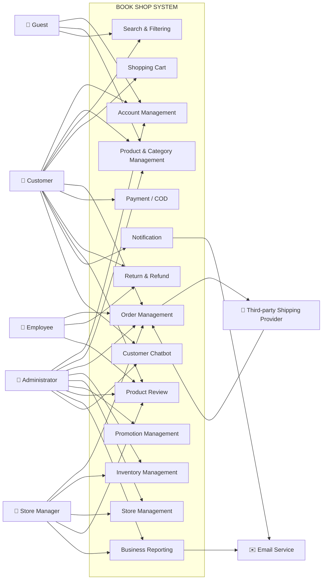
```mermaid
flowchart LR

    Guest["👤 Guest"]
    Customer["👤 Customer"]
    Employee["👤 Employee"]
    Manager["👤 Store Manager"]
    Admin["👤 Administrator"]

    Shipping["🚚 Third-party Shipping Provider"]
    Email["✉️ Email Service"]

    subgraph BOOKSHOP["BOOK SHOP SYSTEM"]

        Account["Account Management"]

        Product["Product & Category Management"]

        Search["Search & Filtering"]

        Cart["Shopping Cart"]

        Order["Order Management"]

        Payment["Payment / COD"]

        Return["Return & Refund"]

        Inventory["Inventory Management"]

        Store["Store Management"]

        Promotion["Promotion Management"]

        Review["Product Review"]

        Notification["Notification"]

        Chatbot["Customer Chatbot"]

        Report["Business Reporting"]

    end

    Guest --> Account
    Guest --> Product
    Guest --> Search

    Customer --> Account
    Customer --> Product
    Customer --> Search
    Customer --> Cart
    Customer --> Order
    Customer --> Payment
    Customer --> Return
    Customer --> Review
    Customer --> Notification
    Customer --> Chatbot

    Employee --> Order
    Employee --> Return
    Employee --> Review

    Manager --> Order
    Manager --> Inventory
    Manager --> Store
    Manager --> Review
    Manager --> Report

    Admin --> Account
    Admin --> Product
    Admin --> Order
    Admin --> Inventory
    Admin --> Store
    Admin --> Promotion
    Admin --> Review
    Admin --> Report
    Admin --> Chatbot

    Order --> Shipping
    Shipping --> Order

    Notification --> Email
    Report --> Email
```

---

# 6. USE CASE CATALOG

## 6.1. Account Management

| ID | Use Case | Primary Actor |
|---|---|---|
| UC-ACC-001 | Register Account | Guest |
| UC-ACC-002 | Register with Google | Guest |
| UC-ACC-003 | Login | Customer |
| UC-ACC-004 | Login with Google | Customer |
| UC-ACC-005 | Verify Account | Customer |
| UC-ACC-006 | Reset Password | Customer |
| UC-ACC-007 | Manage Personal Information | Customer |
| UC-ACC-008 | Manage Shipping Address | Customer |
| UC-ACC-009 | View Purchase History | Customer |

Các use case trên được ánh xạ từ FR-ACC-001 đến FR-ACC-007. SRS cũng bổ sung đăng ký và đăng nhập bằng Google.

---

# 7. UC-ACC-001 — REGISTER ACCOUNT

| Field | Description |
|---|---|
| Use Case ID | UC-ACC-001 |
| Name | Register Account |
| Primary Actor | Guest |
| Goal | Tạo tài khoản Customer mới |
| Related Requirement | FR-ACC-001 |
| Trigger | Guest chọn chức năng Register |
| Priority | Must Have |

### Preconditions

- Guest chưa có tài khoản hoặc đang ở màn hình đăng ký.
- Hệ thống đang hoạt động.

### Main Flow

1. Guest mở chức năng đăng ký.
2. Hệ thống hiển thị form đăng ký.
3. Guest nhập thông tin cần thiết.
4. Guest gửi thông tin đăng ký.
5. Hệ thống kiểm tra dữ liệu.
6. Hệ thống tạo tài khoản.
7. Hệ thống yêu cầu xác minh tài khoản nếu cần.
8. Hệ thống thông báo đăng ký thành công.

### Alternative Flow

**A1 — Dữ liệu không hợp lệ**

1. Hệ thống phát hiện dữ liệu không hợp lệ.
2. Hệ thống thông báo lỗi.
3. Guest chỉnh sửa thông tin.
4. Use Case tiếp tục từ bước 4.

**A2 — Tài khoản đã tồn tại**

1. Hệ thống phát hiện tài khoản đã tồn tại.
2. Hệ thống thông báo cho Guest.
3. Use Case kết thúc.

### Postconditions

- Tài khoản Customer được tạo thành công hoặc yêu cầu đăng ký bị từ chối.

---

# 8. UC-ACC-002 — REGISTER WITH GOOGLE

| Field | Description |
|---|---|
| Use Case ID | UC-ACC-002 |
| Name | Register with Google |
| Primary Actor | Guest |
| Goal | Đăng ký tài khoản thông qua Google |
| Related Requirement | FR-ACC-001 |
| Priority | Must Have |

### Main Flow

1. Guest chọn đăng ký bằng Google.
2. Hệ thống chuyển Guest sang quy trình xác thực Google.
3. Guest xác thực với Google.
4. Google trả kết quả xác thực.
5. Hệ thống kiểm tra thông tin tài khoản.
6. Hệ thống tạo hoặc liên kết tài khoản Customer.
7. Hệ thống thông báo kết quả.

### Alternative Flow

**A1 — Google authentication failed**

1. Google trả kết quả không hợp lệ.
2. Hệ thống từ chối đăng ký.
3. Hệ thống hiển thị lỗi.

---

# 9. UC-ACC-003 — LOGIN

| Field | Description |
|---|---|
| Use Case ID | UC-ACC-003 |
| Name | Login |
| Primary Actor | Customer |
| Goal | Truy cập tài khoản |
| Related Requirement | FR-ACC-002 |
| Priority | Must Have |

### Main Flow

1. Customer mở màn hình Login.
2. Customer nhập thông tin đăng nhập.
3. Customer gửi yêu cầu.
4. Hệ thống xác thực thông tin.
5. Hệ thống cho phép truy cập tài khoản.
6. Hệ thống tạo phiên đăng nhập.

### Alternative Flow

**A1 — Invalid credentials**

1. Hệ thống xác định thông tin đăng nhập không hợp lệ.
2. Hệ thống thông báo lỗi.
3. Customer có thể thử lại.

---

# 10. UC-ACC-004 — LOGIN WITH GOOGLE

| Field | Description |
|---|---|
| Use Case ID | UC-ACC-004 |
| Name | Login with Google |
| Primary Actor | Customer |
| Goal | Đăng nhập bằng Google |
| Related Requirement | FR-ACC-002 |
| Priority | Must Have |

### Main Flow

1. Customer chọn Login with Google.
2. Hệ thống yêu cầu Google authentication.
3. Customer xác thực.
4. Google trả kết quả.
5. Hệ thống xác thực tài khoản.
6. Hệ thống cho phép Customer truy cập hệ thống.

---

# 11. UC-ACC-005 — VERIFY ACCOUNT

| Field | Description |
|---|---|
| Use Case ID | UC-ACC-005 |
| Name | Verify Account |
| Primary Actor | Customer |
| Goal | Xác minh tài khoản |
| Related Requirement | FR-ACC-003 |
| Method | OTP |

### Main Flow

1. Hệ thống yêu cầu xác minh tài khoản.
2. Hệ thống gửi OTP.
3. Customer nhập OTP.
4. Hệ thống kiểm tra OTP.
5. Nếu OTP hợp lệ, hệ thống xác minh tài khoản.
6. Hệ thống thông báo kết quả.

### Alternative Flow

- OTP không hợp lệ.
- OTP hết hạn.
- Customer nhập lại OTP.

---

# 12. UC-ACC-006 — RESET PASSWORD

| Field | Description |
|---|---|
| Use Case ID | UC-ACC-006 |
| Name | Reset Password |
| Primary Actor | Customer |
| Goal | Khôi phục quyền truy cập tài khoản |
| Related Requirement | FR-ACC-004 |

### Main Flow

1. Customer chọn Forgot Password.
2. Customer cung cấp email.
3. Hệ thống gửi OTP.
4. Customer nhập OTP.
5. Hệ thống xác thực OTP.
6. Customer cung cấp mật khẩu mới.
7. Hệ thống cập nhật mật khẩu.
8. Hệ thống thông báo thành công.

---

# 13. UC-ACC-007 — MANAGE PERSONAL INFORMATION

| Field | Description |
|---|---|
| Use Case ID | UC-ACC-007 |
| Primary Actor | Customer |
| Related Requirement | FR-ACC-005 |

### Main Flow

1. Customer mở Profile.
2. Hệ thống hiển thị thông tin hiện tại.
3. Customer chỉnh sửa thông tin.
4. Customer lưu thay đổi.
5. Hệ thống kiểm tra dữ liệu.
6. Hệ thống cập nhật thông tin.
7. Hệ thống thông báo kết quả.

---

# 14. UC-ACC-008 — MANAGE SHIPPING ADDRESS

| Field | Description |
|---|---|
| Use Case ID | UC-ACC-008 |
| Primary Actor | Customer |
| Related Requirement | FR-ACC-006 |

### Supported Operations

- Add Address
- View Address
- Edit Address
- Select Address for Order

---

# 15. UC-ACC-009 — VIEW PURCHASE HISTORY

| Field | Description |
|---|---|
| Use Case ID | UC-ACC-009 |
| Primary Actor | Customer |
| Related Requirement | FR-ACC-007 |

### Main Flow

1. Customer mở Purchase History.
2. Hệ thống lấy các đơn hàng của Customer.
3. Hệ thống hiển thị danh sách.
4. Customer chọn một đơn hàng.
5. Hệ thống hiển thị chi tiết.

---

# 16. PRODUCT & CATEGORY MANAGEMENT

## 16.1. Use Case Diagram

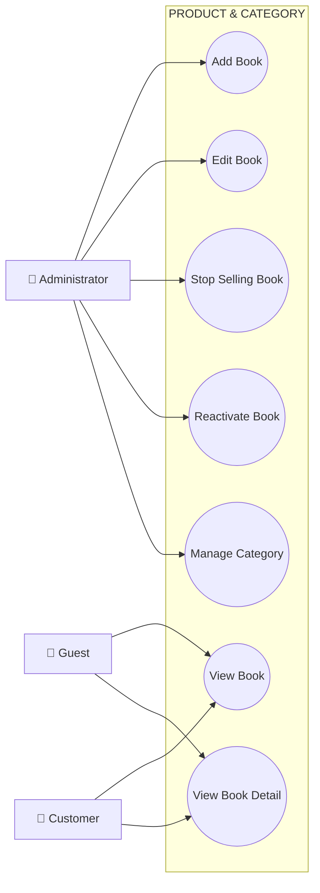
```mermaid
flowchart LR

    Admin["👤 Administrator"]

    Guest["👤 Guest"]
    Customer["👤 Customer"]

    subgraph PRODUCT["PRODUCT & CATEGORY"]
        UC1(("Add Book"))
        UC2(("View Book"))
        UC3(("Edit Book"))
        UC4(("Stop Selling Book"))
        UC5(("Reactivate Book"))
        UC6(("Manage Category"))
        UC7(("View Book Detail"))
    end

    Admin --> UC1
    Admin --> UC3
    Admin --> UC4
    Admin --> UC5
    Admin --> UC6

    Guest --> UC2
    Guest --> UC7

    Customer --> UC2
    Customer --> UC7
```

---

# 17. PRODUCT USE CASES

| ID | Use Case | Actor | Requirement |
|---|---|---|---|
| UC-PROD-001 | Add Book | Administrator | FR-PROD-001 |
| UC-PROD-002 | View Book | All authorized users | FR-PROD-002 |
| UC-PROD-003 | Edit Book | Administrator | FR-PROD-003 |
| UC-PROD-004 | Stop Selling Book | Administrator | FR-PROD-004 |
| UC-PROD-005 | Reactivate Book | Administrator | FR-PROD-005 |
| UC-PROD-006 | View Book Detail | Guest/Customer | FR-PROD-006 |
| UC-PROD-007 | Add Book to Cart | Customer | FR-PROD-007 |
| UC-PROD-008 | Buy Now | Customer | FR-PROD-008 |

---

# 18. UC-PROD-001 — ADD BOOK

### Preconditions

- Actor đã đăng nhập.
- Actor có quyền Administrator.

### Main Flow

1. Administrator mở Product Management.
2. Chọn Add Book.
3. Nhập thông tin sách.
4. Hệ thống kiểm tra dữ liệu.
5. Administrator xác nhận.
6. Hệ thống tạo sách.
7. Hệ thống hiển thị kết quả.

### Business Rules

- Selling Price không được nhỏ hơn 0.
- Các thông tin bắt buộc phải được cung cấp.

Business Rule BR-001 yêu cầu hệ thống từ chối giá bán nhỏ hơn 0.

---

# 19. SEARCH & FILTERING

## 19.1. Use Case Diagram

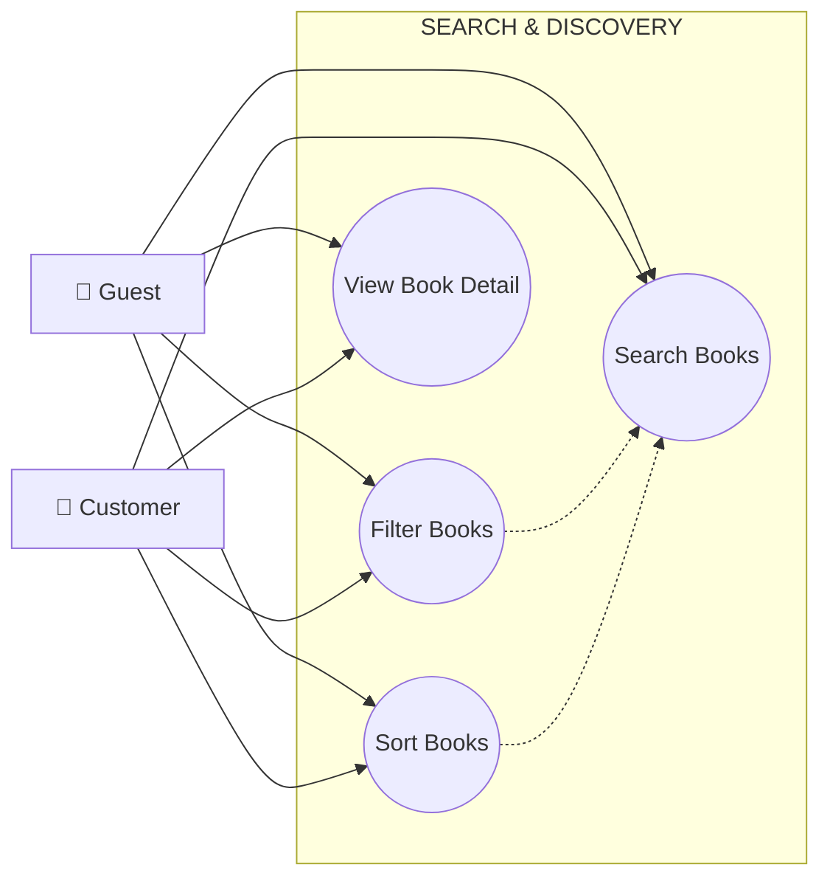
```mermaid
flowchart LR

    Guest["👤 Guest"]
    Customer["👤 Customer"]

    subgraph SEARCH["SEARCH & DISCOVERY"]
        Search(("Search Books"))
        Filter(("Filter Books"))
        Sort(("Sort Books"))
        Detail(("View Book Detail"))
    end

    Guest --> Search
    Guest --> Filter
    Guest --> Sort
    Guest --> Detail

    Customer --> Search
    Customer --> Filter
    Customer --> Sort
    Customer --> Detail

    Filter -.-> Search
    Sort -.-> Search
```

### Use Cases

| ID | Use Case | Actor |
|---|---|---|
| UC-SEARCH-001 | Search Books | Guest, Customer |
| UC-SEARCH-002 | Filter Books | Guest, Customer |
| UC-SEARCH-003 | Sort Books | Guest, Customer |
| UC-SEARCH-004 | View Book Detail | Guest, Customer |

Search hỗ trợ tên sách, tác giả, nhà xuất bản, thể loại và từ khóa liên quan. Filter hỗ trợ giá, thể loại, nhà xuất bản, đánh giá và tình trạng còn hàng.

---

# 20. SHOPPING CART

## 20.1. Use Case Diagram

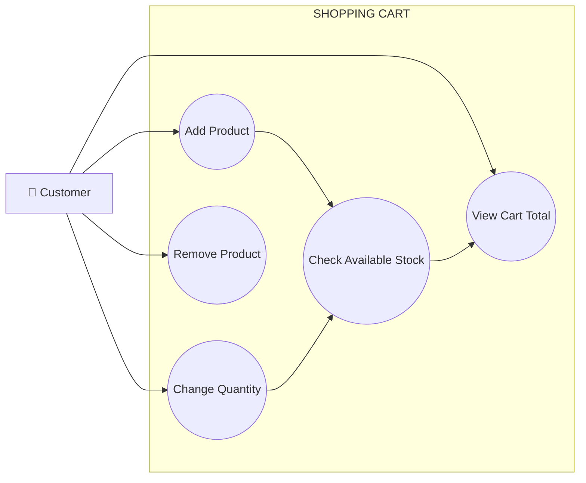
```mermaid
flowchart LR

    Customer["👤 Customer"]

    subgraph CART["SHOPPING CART"]
        Add(("Add Product"))
        Change(("Change Quantity"))
        Remove(("Remove Product"))
        Total(("View Cart Total"))
        Stock(("Check Available Stock"))
    end

    Customer --> Add
    Customer --> Change
    Customer --> Remove
    Customer --> Total

    Add --> Stock
    Change --> Stock
    Stock --> Total
```

## 20.2. Use Case List

| ID | Use Case | Actor | Requirement |
|---|---|---|---|
| UC-CART-001 | Add Product | Customer | FR-CART-001 |
| UC-CART-002 | Change Quantity | Customer | FR-CART-002 |
| UC-CART-003 | Remove Product | Customer | FR-CART-003 |
| UC-CART-004 | View Cart Total | Customer | FR-CART-004 |
| UC-CART-005 | Check Available Stock | Customer/System | FR-CART-005 |

### Important Business Rule

Customer không được đặt số lượng vượt quá số lượng hàng có thể bán.

```text
Requested Quantity <= Available Quantity
```

Quy tắc này được xác định tại BR-002 và FR-CART-005.

---

# 21. ORDER & CHECKOUT

## 21.1. Use Case Diagram

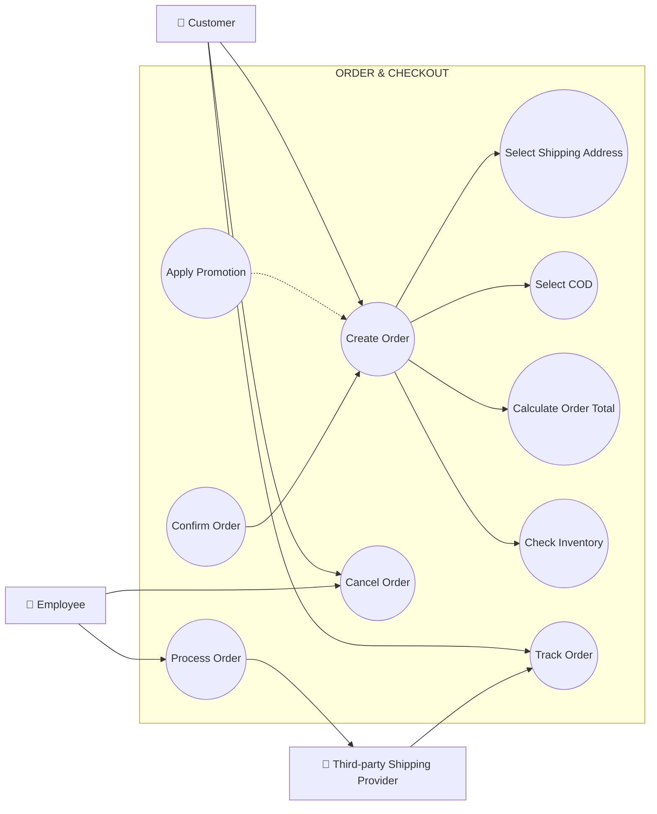
```mermaid
flowchart LR

    Customer["👤 Customer"]
    Employee["👤 Employee"]
    Shipping["🚚 Third-party Shipping Provider"]

    subgraph ORDER["ORDER & CHECKOUT"]
        Create(("Create Order"))
        Address(("Select Shipping Address"))
        Payment(("Select COD"))
        Promo(("Apply Promotion"))
        Total(("Calculate Order Total"))
        Stock(("Check Inventory"))
        Confirm(("Confirm Order"))
        Track(("Track Order"))
        Cancel(("Cancel Order"))
        Process(("Process Order"))
    end

    Customer --> Create
    Customer --> Track
    Customer --> Cancel

    Create --> Address
    Create --> Payment
    Create --> Total
    Create --> Stock
    Promo -.-> Create
    Confirm --> Create

    Employee --> Process
    Employee --> Cancel

    Process --> Shipping
    Shipping --> Track
```

---

# 22. UC-ORDER-001 — CREATE ORDER

| Field | Description |
|---|---|
| Use Case ID | UC-ORDER-001 |
| Name | Create Order |
| Primary Actor | Customer |
| Related Requirements | FR-ORDER-001 → FR-ORDER-005 |
| Priority | Must Have |

### Preconditions

- Customer đã đăng nhập.
- Sản phẩm được chọn tồn tại.
- Sản phẩm có thể bán.
- Customer có địa chỉ giao hàng hợp lệ.

### Main Flow

1. Customer chọn sản phẩm.
2. Customer thêm sản phẩm vào Cart hoặc chọn Buy Now.
3. Customer mở Checkout.
4. Hệ thống hiển thị sản phẩm và số lượng.
5. Customer chọn địa chỉ giao hàng.
6. Customer chọn phương thức thanh toán COD.
7. Customer áp dụng promotion nếu có.
8. Hệ thống kiểm tra promotion.
9. Hệ thống kiểm tra tồn kho.
10. Hệ thống tính tổng tiền.
11. Hệ thống hiển thị tổng tiền.
12. Customer xác nhận đơn.
13. Hệ thống tạo Order.
14. Order được tạo với trạng thái **Chờ xác nhận**.
15. Hệ thống thông báo kết quả.

### Alternative Flow

**A1 — Không đủ tồn kho**

1. Hệ thống phát hiện Available Quantity không đủ.
2. Hệ thống từ chối tạo đơn.
3. Hệ thống thông báo số lượng có thể mua.

**A2 — Promotion không hợp lệ**

1. Hệ thống kiểm tra promotion.
2. Promotion không thỏa điều kiện.
3. Hệ thống không áp dụng promotion.
4. Customer có thể tiếp tục với giá không giảm.

**A3 — Customer không xác nhận**

1. Customer quay lại Cart.
2. Order chưa được tạo.

---

# 23. UC-ORDER-002 — CALCULATE ORDER TOTAL

### Main Flow

Hệ thống xác định:

```text
Total
=
Product Price × Quantity
− Promotion Discount
+ Supported Additional Charges
```

Hệ thống phải hiển thị tổng tiền rõ ràng trước khi Customer xác nhận đơn.

Yêu cầu này tương ứng với FR-ORDER-002 và BR-009.

---

# 24. UC-ORDER-003 — CONFIRM ORDER

### Main Flow

1. Customer kiểm tra thông tin checkout.
2. Customer xác nhận Order.
3. Hệ thống kiểm tra lại điều kiện cần thiết.
4. Hệ thống tạo Order.
5. Hệ thống đặt trạng thái **Chờ xác nhận**.
6. Hệ thống cập nhật dữ liệu liên quan.
7. Hệ thống gửi notification.

---

# 25. ORDER LIFECYCLE

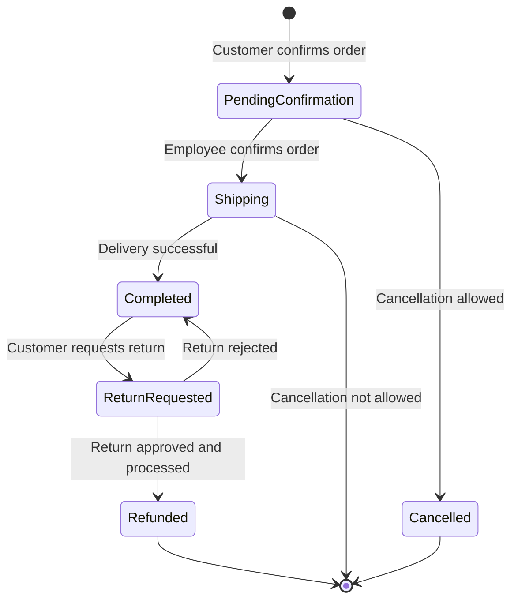
```mermaid
stateDiagram-v2

    [*] --> PendingConfirmation: Customer confirms order

    PendingConfirmation --> Shipping: Employee confirms order
    PendingConfirmation --> Cancelled: Cancellation allowed

    Shipping --> Completed: Delivery successful
    Shipping --> [*]: Cancellation not allowed

    Completed --> ReturnRequested: Customer requests return
    ReturnRequested --> Refunded: Return approved and processed
    ReturnRequested --> Completed: Return rejected

    Cancelled --> [*]
    Refunded --> [*]
```

Lifecycle tối thiểu của Order trong SRS là:

```text
Chờ xác nhận
      ↓
Đang vận chuyển
      ↓
Hoàn tất
```

và Order có thể chuyển sang trạng thái Hủy theo điều kiện nghiệp vụ.

---

# 26. UC-ORDER-004 — CUSTOMER CANCEL ORDER

| Field | Description |
|---|---|
| Use Case ID | UC-ORDER-004 |
| Primary Actor | Customer |
| Related Requirement | FR-ORDER-007 |

### Preconditions

Customer có Order.

### Main Flow

1. Customer mở Order Detail.
2. Customer chọn Cancel Order.
3. Hệ thống kiểm tra Order Status.
4. Hệ thống kiểm tra Cancellation Policy.
5. Nếu được phép, hệ thống hủy Order.
6. Hệ thống cập nhật dữ liệu liên quan.
7. Hệ thống gửi notification.

### Exception

Nếu:

```text
Order Status = Đang vận chuyển
```

hệ thống phải từ chối thao tác hủy.

Điều này được quy định trực tiếp tại FR-ORDER-007 và BR-010.

---

# 27. ORDER MANAGEMENT — EMPLOYEE

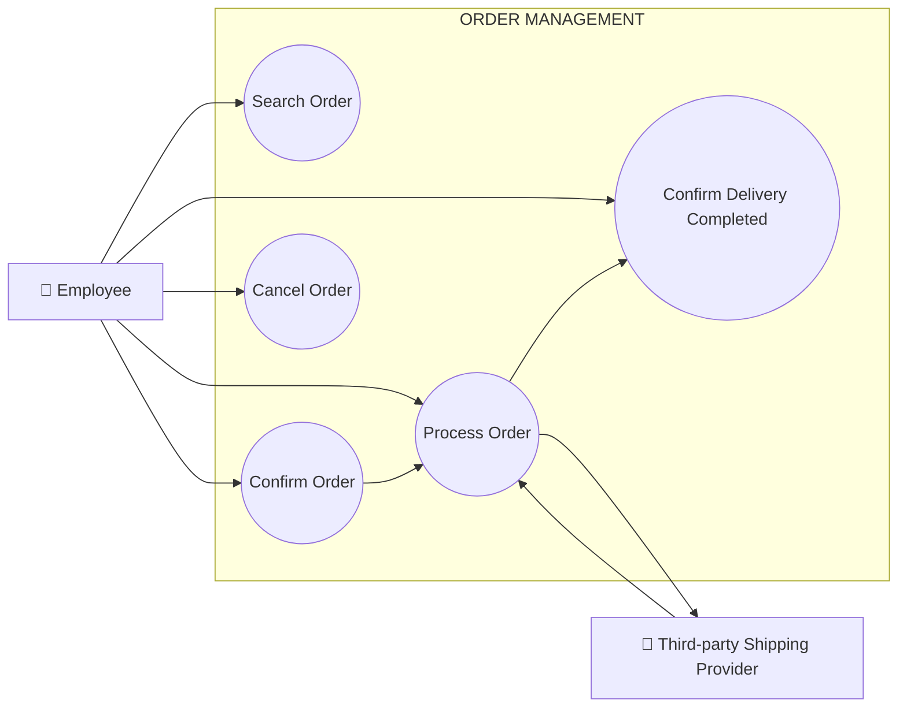
```mermaid
flowchart LR

    Employee["👤 Employee"]

    subgraph ORDER_MGMT["ORDER MANAGEMENT"]
        Search(("Search Order"))
        Confirm(("Confirm Order"))
        Process(("Process Order"))
        Cancel(("Cancel Order"))
        Complete(("Confirm Delivery Completed"))
    end

    Shipping["🚚 Third-party Shipping Provider"]

    Employee --> Search
    Employee --> Confirm
    Employee --> Process
    Employee --> Cancel
    Employee --> Complete

    Confirm --> Process
    Process --> Shipping
    Shipping --> Process
    Process --> Complete
```

## Use Cases

| ID | Use Case | Actor |
|---|---|---|
| UC-ORDER-005 | Search Order | Employee |
| UC-ORDER-006 | Confirm Order | Employee |
| UC-ORDER-007 | Process Order | Employee |
| UC-ORDER-008 | Cancel Order | Employee |
| UC-ORDER-009 | Confirm Delivery Completed | Employee |

Employee có trách nhiệm tìm kiếm, xác nhận, xử lý đơn, chuyển đơn cho bên vận chuyển và xác nhận trạng thái giao hàng.

---

# 28. PAYMENT — COD

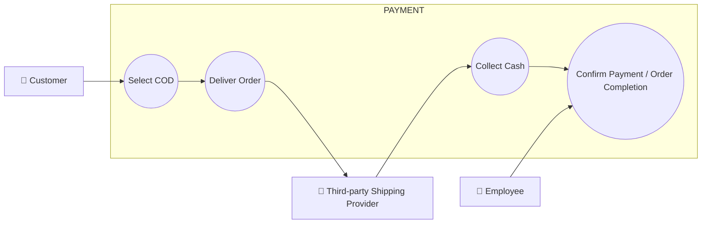
```mermaid
flowchart LR

    Customer["👤 Customer"]
    Shipping["🚚 Third-party Shipping Provider"]
    Employee["👤 Employee"]

    subgraph PAYMENT["PAYMENT"]
        Select(("Select COD"))
        Deliver(("Deliver Order"))
        Collect(("Collect Cash"))
        Complete(("Confirm Payment / Order Completion"))
    end

    Customer --> Select
    Select --> Deliver
    Deliver --> Shipping
    Shipping --> Collect
    Collect --> Complete
    Employee --> Complete
```

### UC-PAY-001 — PAY BY COD

**Primary Actor:** Customer

### Main Flow

1. Customer chọn COD.
2. Hệ thống ghi nhận phương thức thanh toán COD.
3. Order được xác nhận.
4. Order được chuyển cho bên vận chuyển.
5. Bên vận chuyển giao hàng.
6. Customer thanh toán khi nhận hàng.
7. Book Shop nhận thông tin/thanh toán.
8. Employee xác nhận hoàn tất Order.

Version 1.0 chỉ hỗ trợ COD và không hỗ trợ payment gateway online.

---

# 29. RETURN & REFUND

## 29.1. Use Case Diagram

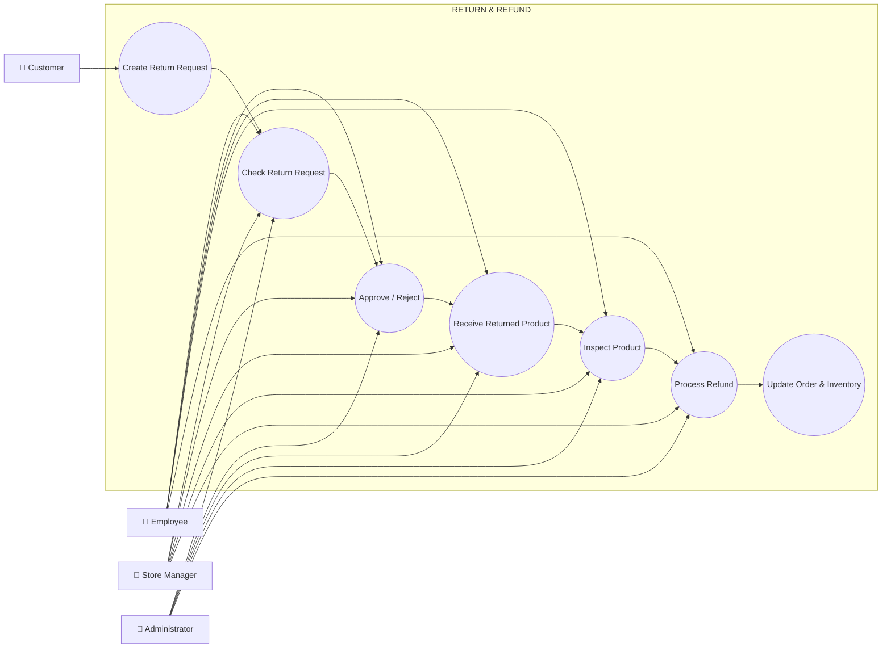
```mermaid
flowchart LR

    Customer["👤 Customer"]
    Employee["👤 Employee"]
    Manager["👤 Store Manager"]
    Admin["👤 Administrator"]

    subgraph RETURN["RETURN & REFUND"]
        Request(("Create Return Request"))
        Check(("Check Return Request"))
        Decision(("Approve / Reject"))
        Receive(("Receive Returned Product"))
        Inspect(("Inspect Product"))
        Refund(("Process Refund"))
        Update(("Update Order & Inventory"))
    end

    Customer --> Request

    Employee --> Check
    Employee --> Decision
    Employee --> Receive
    Employee --> Inspect
    Employee --> Refund

    Manager --> Check
    Manager --> Decision
    Manager --> Receive
    Manager --> Inspect
    Manager --> Refund

    Admin --> Check
    Admin --> Decision
    Admin --> Receive
    Admin --> Inspect
    Admin --> Refund

    Request --> Check
    Check --> Decision

    Decision --> Receive
    Receive --> Inspect
    Inspect --> Refund
    Refund --> Update
```

## Use Case List

| ID | Use Case | Actor |
|---|---|---|
| UC-RETURN-001 | Create Return Request | Customer |
| UC-RETURN-002 | Check Return Request | Employee / Store Manager / Admin |
| UC-RETURN-003 | Approve Return | Authorized Staff |
| UC-RETURN-004 | Reject Return | Authorized Staff |
| UC-RETURN-005 | Receive Returned Product | Authorized Staff |
| UC-RETURN-006 | Inspect Returned Product | Authorized Staff |
| UC-RETURN-007 | Process Refund | Authorized Staff |
| UC-RETURN-008 | Update Order & Inventory | System |

---

# 30. UC-RETURN-001 — CREATE RETURN REQUEST

### Preconditions

- Order ở trạng thái **Hoàn tất**.
- Customer đã nhận hàng.
- Không quá 3 ngày kể từ khi nhận hàng.

### Main Flow

1. Customer mở Order Detail.
2. Customer chọn Return/Refund.
3. Hệ thống kiểm tra điều kiện.
4. Customer cung cấp minh chứng.
5. Customer cung cấp thông tin tài khoản ngân hàng.
6. Customer gửi request.
7. Hệ thống tạo Return Request.
8. Hệ thống thông báo kết quả.

### Exception

Nếu Order chưa hoàn tất hoặc quá thời hạn 3 ngày:

```text
Return Request = Rejected
```

SRS quy định Customer chỉ có thể yêu cầu trả hàng sau khi nhận hàng và Order ở trạng thái Hoàn tất, trong thời gian không quá 3 ngày.

---

# 31. RETURN & REFUND LIFECYCLE

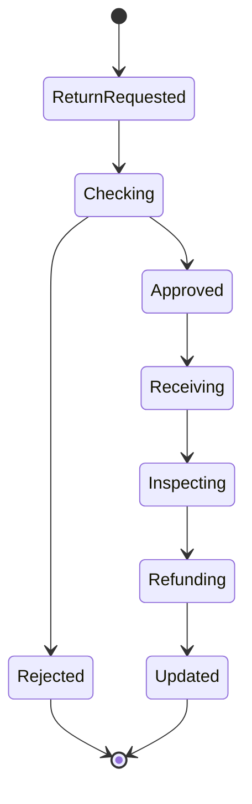
```mermaid
stateDiagram-v2

    [*] --> ReturnRequested

    ReturnRequested --> Checking

    Checking --> Approved
    Checking --> Rejected

    Approved --> Receiving
    Receiving --> Inspecting
    Inspecting --> Refunding
    Refunding --> Updated

    Rejected --> [*]
    Updated --> [*]
```

---

# 32. INVENTORY MANAGEMENT

## 32.1. Use Case Diagram

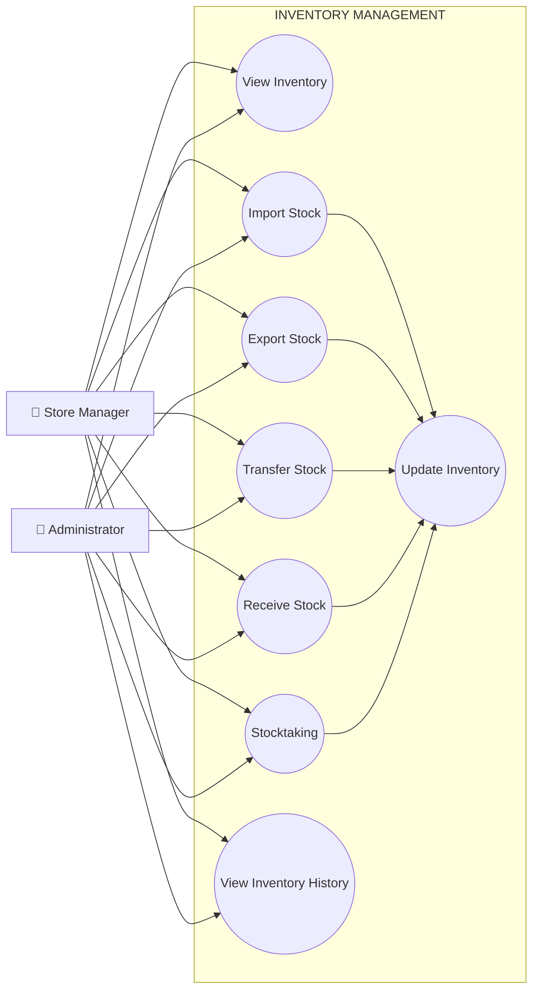
```mermaid
flowchart LR

    Manager["👤 Store Manager"]
    Admin["👤 Administrator"]

    subgraph INVENTORY["INVENTORY MANAGEMENT"]
        View(("View Inventory"))
        Count(("Stocktaking"))
        Import(("Import Stock"))
        Export(("Export Stock"))
        Transfer(("Transfer Stock"))
        Receive(("Receive Stock"))
        History(("View Inventory History"))
        Update(("Update Inventory"))
    end

    Manager --> View
    Manager --> Count
    Manager --> Import
    Manager --> Export
    Manager --> Transfer
    Manager --> Receive
    Manager --> History

    Admin --> View
    Admin --> Count
    Admin --> Import
    Admin --> Export
    Admin --> Transfer
    Admin --> Receive
    Admin --> History

    Import --> Update
    Export --> Update
    Transfer --> Update
    Receive --> Update
    Count --> Update
```

## Inventory Use Cases

| ID | Use Case | Actor |
|---|---|---|
| UC-INV-001 | View Inventory | Store Manager, Admin |
| UC-INV-002 | Stocktaking | Store Manager, Admin |
| UC-INV-003 | Import Stock | Store Manager, Admin |
| UC-INV-004 | Export Stock | Store Manager, Admin |
| UC-INV-005 | Transfer Stock | Store Manager, Admin |
| UC-INV-006 | Receive Stock | Store Manager, Admin |
| UC-INV-007 | View Inventory History | Store Manager, Admin |
| UC-INV-008 | Update Inventory | System |

Inventory phải quản lý Current Quantity, Reserved Quantity, Available Quantity, Damaged Quantity và Pending Incoming Quantity.

---

# 33. STORE MANAGEMENT

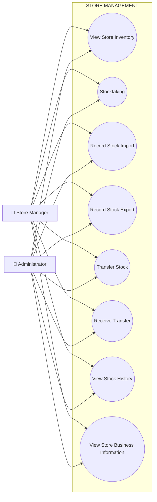
```mermaid
flowchart LR

    Manager["👤 Store Manager"]
    Admin["👤 Administrator"]

    subgraph STORE["STORE MANAGEMENT"]
        View(("View Store Inventory"))
        Count(("Stocktaking"))
        Import(("Record Stock Import"))
        Export(("Record Stock Export"))
        Transfer(("Transfer Stock"))
        Receive(("Receive Transfer"))
        History(("View Stock History"))
        Business(("View Store Business Information"))
    end

    Manager --> View
    Manager --> Count
    Manager --> Import
    Manager --> Export
    Manager --> Transfer
    Manager --> Receive
    Manager --> History
    Manager --> Business

    Admin --> View
    Admin --> Count
    Admin --> Import
    Admin --> Export
    Admin --> Transfer
    Admin --> Receive
    Admin --> History
    Admin --> Business
```

Store Manager chỉ được thao tác trong phạm vi cửa hàng được phân công.

---

# 34. PROMOTION MANAGEMENT

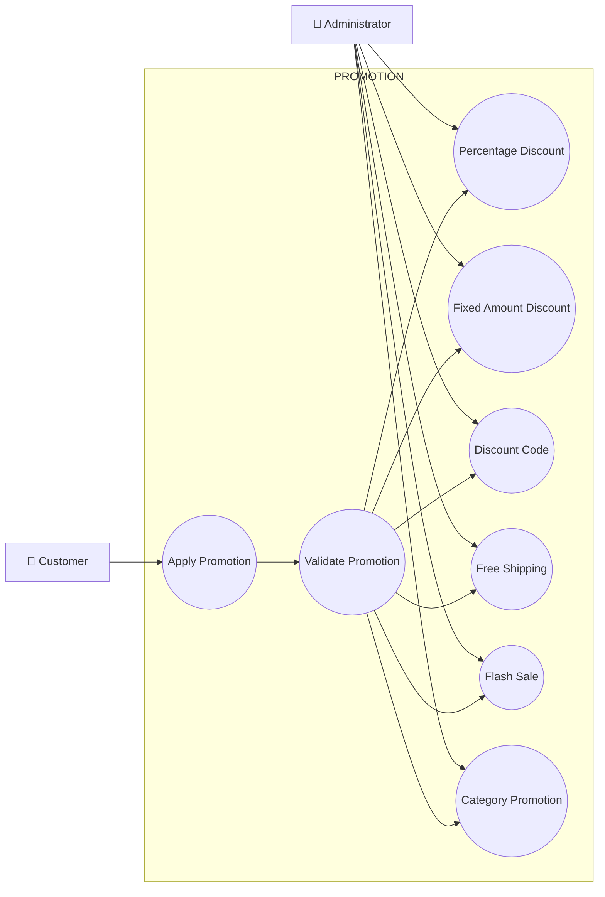
```mermaid
flowchart LR

    Admin["👤 Administrator"]
    Customer["👤 Customer"]

    subgraph PROMOTION["PROMOTION"]
        Percentage(("Percentage Discount"))
        Fixed(("Fixed Amount Discount"))
        Coupon(("Discount Code"))
        FreeShip(("Free Shipping"))
        Flash(("Flash Sale"))
        Category(("Category Promotion"))
        Validate(("Validate Promotion"))
        Apply(("Apply Promotion"))
    end

    Admin --> Percentage
    Admin --> Fixed
    Admin --> Coupon
    Admin --> FreeShip
    Admin --> Flash
    Admin --> Category

    Customer --> Apply
    Apply --> Validate

    Validate --> Percentage
    Validate --> Fixed
    Validate --> Coupon
    Validate --> FreeShip
    Validate --> Flash
    Validate --> Category
```

### Promotion Validation

Promotion phải được kiểm tra theo:

- Product.
- Order value.
- Effective time.
- Usage count.

Promotion hết hạn không được áp dụng.

---

# 35. PRODUCT REVIEW

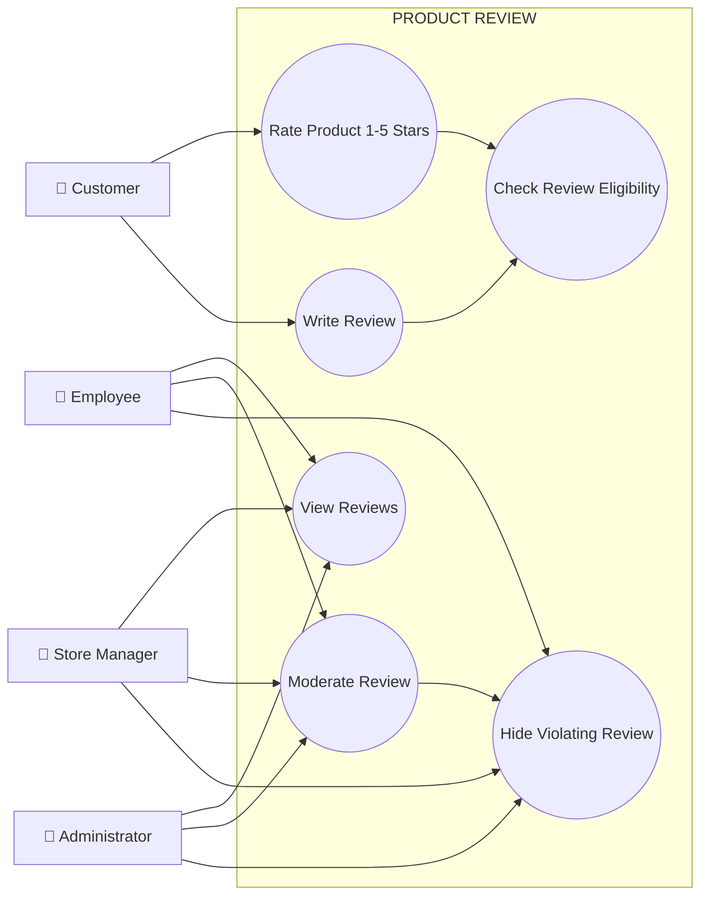
```mermaid
flowchart LR

    Customer["👤 Customer"]
    Employee["👤 Employee"]
    Manager["👤 Store Manager"]
    Admin["👤 Administrator"]

    subgraph REVIEW["PRODUCT REVIEW"]
        Rate(("Rate Product 1-5 Stars"))
        Comment(("Write Review"))
        Check(("Check Review Eligibility"))
        View(("View Reviews"))
        Moderate(("Moderate Review"))
        Hide(("Hide Violating Review"))
    end

    Customer --> Rate
    Customer --> Comment

    Rate --> Check
    Comment --> Check

    Employee --> View
    Employee --> Moderate
    Employee --> Hide

    Manager --> View
    Manager --> Moderate
    Manager --> Hide

    Admin --> View
    Admin --> Moderate
    Admin --> Hide

    Moderate --> Hide
```

### Business Rule

Customer có thể đánh giá từ **1 đến 5 sao**.

Book Shop có thể yêu cầu Customer phải mua sản phẩm trước khi đánh giá.

---

# 36. NOTIFICATION

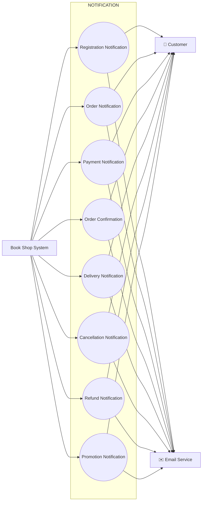
```mermaid
flowchart LR

    Customer["👤 Customer"]
    System["Book Shop System"]
    Email["✉️ Email Service"]

    subgraph NOTIFICATION["NOTIFICATION"]
        Register(("Registration Notification"))
        Order(("Order Notification"))
        Payment(("Payment Notification"))
        Confirm(("Order Confirmation"))
        Delivery(("Delivery Notification"))
        Cancel(("Cancellation Notification"))
        Refund(("Refund Notification"))
        Promo(("Promotion Notification"))
    end

    System --> Register
    System --> Order
    System --> Payment
    System --> Confirm
    System --> Delivery
    System --> Cancel
    System --> Refund
    System --> Promo

    Register --> Customer
    Order --> Customer
    Payment --> Customer
    Confirm --> Customer
    Delivery --> Customer
    Cancel --> Customer
    Refund --> Customer
    Promo --> Customer

    Register --> Email
    Order --> Email
    Payment --> Email
    Confirm --> Email
    Delivery --> Email
    Cancel --> Email
    Refund --> Email
    Promo --> Email
```

SRS yêu cầu notification cho các sự kiện đăng ký, đặt hàng, thanh toán, xác nhận đơn, giao hàng, hủy đơn, hoàn tiền và khuyến mãi; kênh là trong hệ thống và Email.

---

# 37. CUSTOMER CHATBOT

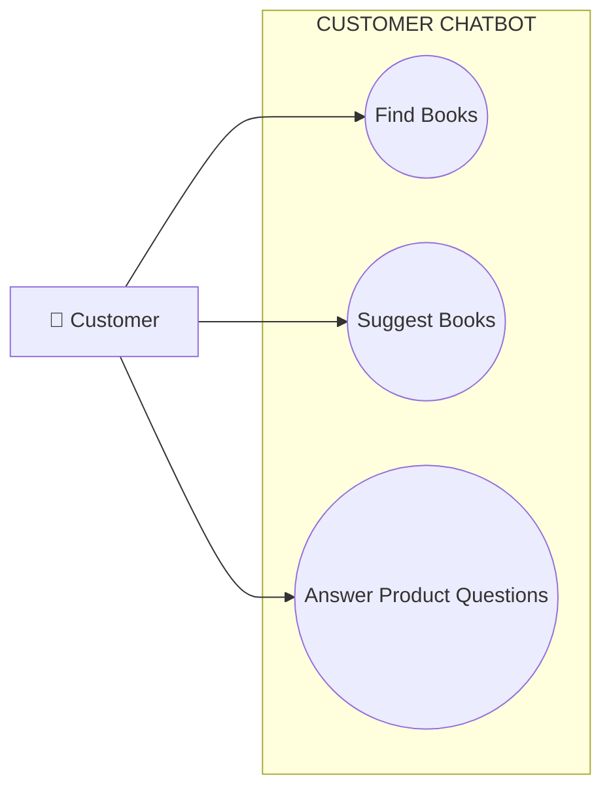
```mermaid
flowchart LR

    Customer["👤 Customer"]

    subgraph CHATBOT["CUSTOMER CHATBOT"]
        Search(("Find Books"))
        Recommend(("Suggest Books"))
        ProductQA(("Answer Product Questions"))
    end

    Customer --> Search
    Customer --> Recommend
    Customer --> ProductQA
```

## Use Cases

| ID | Use Case | Actor |
|---|---|---|
| UC-CHAT-001 | Find Books | Customer |
| UC-CHAT-002 | Suggest Books | Customer |
| UC-CHAT-003 | Answer Product Questions | Customer |

Personalized recommendation is **not mandatory for version 1.0**.

---

# 38. BUSINESS REPORTING

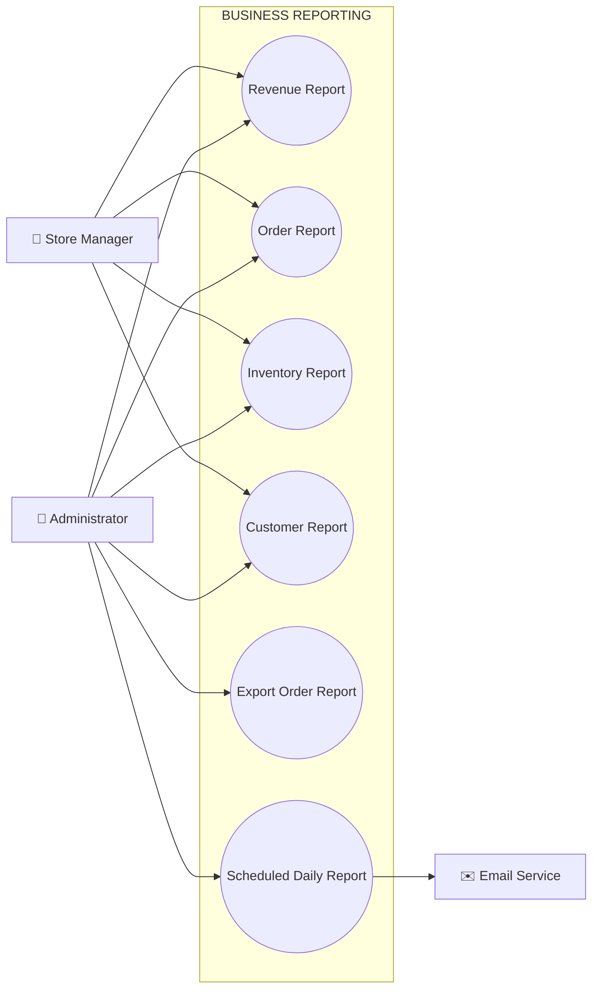
```mermaid
flowchart LR

    Manager["👤 Store Manager"]
    Admin["👤 Administrator"]
    Email["✉️ Email Service"]

    subgraph REPORT["BUSINESS REPORTING"]
        Revenue(("Revenue Report"))
        OrderReport(("Order Report"))
        InventoryReport(("Inventory Report"))
        CustomerReport(("Customer Report"))
        Export(("Export Order Report"))
        Schedule(("Scheduled Daily Report"))
    end

    Manager --> Revenue
    Manager --> OrderReport
    Manager --> InventoryReport
    Manager --> CustomerReport

    Admin --> Revenue
    Admin --> OrderReport
    Admin --> InventoryReport
    Admin --> CustomerReport
    Admin --> Export
    Admin --> Schedule

    Schedule --> Email
```

## Reports

### Revenue Report

Có thể xem theo:

- Day
- Week
- Month
- Quarter
- Year
- Store
- Product
- Category

### Order Report

- New Orders
- Processing Orders
- Completed Orders
- Cancelled Orders

### Inventory Report

- Low Stock Books
- Out-of-stock Books
- Best-selling Books
- Slow-moving Books

### Customer Report

- New Customers
- Returning Customers
- Purchase Frequency

Các loại báo cáo trên được xác định trong FR-REPORT-001 đến FR-REPORT-004.

---

# 39. CROSS-MODULE USE CASE RELATIONSHIPS

## 39.1. Order Relationship

Một Order có các hành vi bắt buộc:

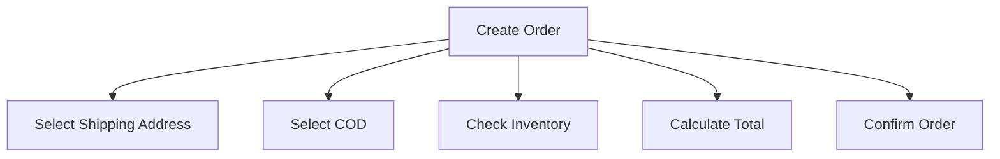
```mermaid
flowchart TD

    Create["Create Order"]

    Address["Select Shipping Address"]
    Payment["Select COD"]
    Stock["Check Inventory"]
    Total["Calculate Total"]
    Confirm["Confirm Order"]

    Create --> Address
    Create --> Payment
    Create --> Stock
    Create --> Total
    Create --> Confirm
```

Trong tài liệu Use Case, các chức năng bắt buộc có thể biểu diễn bằng:

```text
Create Order
    <<include>> Select Shipping Address
    <<include>> Select Payment Method
    <<include>> Check Inventory
    <<include>> Calculate Order Total
    <<include>> Confirm Order
```

---

## 39.2. Promotion Relationship

Promotion là chức năng tùy chọn trong checkout:

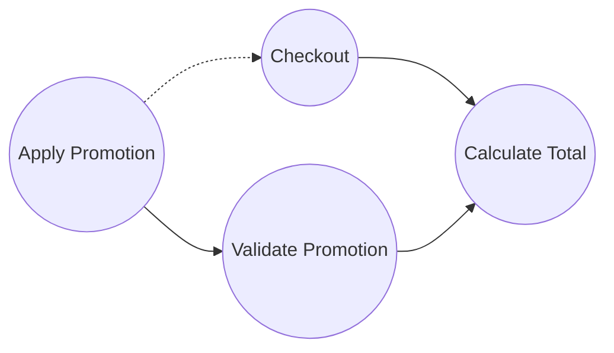
```mermaid
flowchart LR

    Checkout(("Checkout"))
    Promotion(("Apply Promotion"))
    Validate(("Validate Promotion"))
    Calculate(("Calculate Total"))

    Checkout --> Calculate
    Promotion -.-> Checkout
    Promotion --> Validate
    Validate --> Calculate
```

Vì Customer **có thể** áp dụng promotion hoặc không, `Apply Promotion` được xem là hành vi tùy chọn của Checkout.

---

## 39.3. Return & Refund Relationship

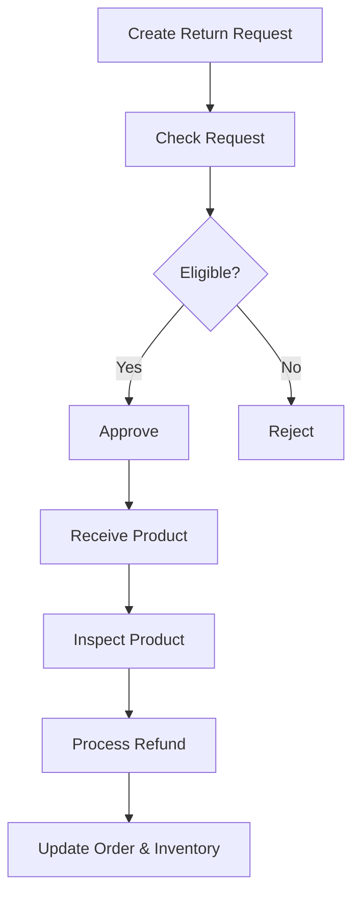
```mermaid
flowchart TD

    Request["Create Return Request"]
    Check["Check Request"]
    Decision{"Eligible?"}

    Approve["Approve"]
    Reject["Reject"]

    Receive["Receive Product"]
    Inspect["Inspect Product"]
    Refund["Process Refund"]
    Update["Update Order & Inventory"]

    Request --> Check
    Check --> Decision

    Decision -->|Yes| Approve
    Decision -->|No| Reject

    Approve --> Receive
    Receive --> Inspect
    Inspect --> Refund
    Refund --> Update
```

---

# 40. AUTHORIZATION MODEL

Authorization không phải là một Use Case độc lập mà là **cross-cutting business behavior** áp dụng cho các Use Case cần quyền.

```mermaid
flowchart LR

    Actor["Actor"]

    Authorization(("Check Authorization"))

    UC1(("Manage Product"))
    UC2(("Process Order"))
    UC3(("Manage Inventory"))
    UC4(("Manage Promotion"))
    UC5(("View Report"))

    Actor --> Authorization

    Authorization --> UC1
    Authorization --> UC2
    Authorization --> UC3
    Authorization --> UC4
    Authorization --> UC5
```

Ví dụ:

```text
Administrator
    → Manage Product
    → Manage Promotion
    → Manage Inventory
    → View Reports

Store Manager
    → Manage Inventory
    → Store Management
    → Assigned Order Management
    → Assigned Store Reports

Employee
    → Order Management
    → Return/Refund according to permission
```

Ma trận quyền này được xây dựng từ authorization matrix của SRS.

---

# 41. COMPLETE CUSTOMER JOURNEY

Use Case flow quan trọng nhất của Customer:

```mermaid
flowchart TD

    Start([Start])

    Register["Register Account"]
    Verify["Verify Account"]
    Login["Login"]

    Search["Search Books"]
    Detail["View Book Detail"]

    Decision1{"Add to Cart or Buy Now?"}

    Cart["Manage Shopping Cart"]
    Checkout["Checkout"]

    Address["Select Address"]
    COD["Select COD"]
    Promotion["Apply Promotion"]
    Stock["Check Inventory"]
    Total["Calculate Total"]

    Confirm["Confirm Order"]

    Pending["Order: Chờ xác nhận"]
    Shipping["Order: Đang vận chuyển"]
    Completed["Order: Hoàn tất"]

    Track["Track Order"]

    Review["Review Product"]

    Return["Request Return"]
    Refund["Refund"]

    End([End])

    Start --> Register
    Register --> Verify
    Verify --> Login

    Login --> Search
    Search --> Detail

    Detail --> Decision1

    Decision1 -->|Add to Cart| Cart
    Cart --> Checkout

    Decision1 -->|Buy Now| Checkout

    Checkout --> Address
    Checkout --> COD
    Checkout --> Promotion
    Checkout --> Stock
    Checkout --> Total

    Address --> Confirm
    COD --> Confirm
    Promotion --> Confirm
    Stock --> Confirm
    Total --> Confirm

    Confirm --> Pending
    Pending --> Shipping
    Shipping --> Completed

    Pending --> Track
    Shipping --> Track
    Completed --> Track

    Completed --> Review
    Completed --> Return
    Return --> Refund

    Review --> End
    Refund --> End
    Track --> End
```

---

# 42. COMPLETE ADMIN JOURNEY

```mermaid
flowchart TD

    Start([Administrator Login])

    Product["Manage Products"]
    Category["Manage Categories"]
    Promotion["Manage Promotions"]
    User["Manage Users"]
    Inventory["Manage Inventory"]
    Store["Manage Stores"]
    Order["Manage Orders"]
    Review["Moderate Reviews"]
    Report["View Business Reports"]

    Export["Export Order Report"]
    Email["Receive Daily Report Email"]

    Start --> Product
    Start --> Category
    Start --> Promotion
    Start --> User
    Start --> Inventory
    Start --> Store
    Start --> Order
    Start --> Review
    Start --> Report

    Report --> Export
    Report --> Email
```

Administrator có quyền quản lý toàn bộ các hoạt động mà Book Shop cho phép, bao gồm user, product, category, order, inventory, store, promotion, review và report.

---

# 43. COMPLETE EMPLOYEE JOURNEY

```mermaid
flowchart TD

    Start([Employee Login])

    Search["Search Order"]
    Confirm["Confirm Order"]
    Process["Process Order"]
    Shipping["Third-party Shipping"]
    Delivery["Receive Delivery Status"]
    Complete["Confirm Completed"]
    Cancel["Cancel Order"]
    Return["Process Return / Refund"]

    Start --> Search
    Search --> Confirm
    Confirm --> Process
    Process --> Shipping
    Shipping --> Delivery
    Delivery --> Complete

    Search --> Cancel
    Search --> Return
```

---

# 44. COMPLETE STORE MANAGER JOURNEY

```mermaid
flowchart TD

    Start([Store Manager Login])

    Inventory["View Inventory"]
    Count["Stocktaking"]
    Import["Import Stock"]
    Export["Export Stock"]
    Transfer["Transfer Stock"]
    Receive["Receive Stock"]
    History["View Inventory History"]

    Order["Manage Assigned Orders"]
    Business["View Store Business Information"]

    Start --> Inventory
    Start --> Order
    Start --> Business

    Inventory --> Count
    Inventory --> Import
    Inventory --> Export
    Inventory --> Transfer

    Transfer --> Receive

    Count --> History
    Import --> History
    Export --> History
    Receive --> History
```

---

# 45. USE CASE TRACEABILITY MATRIX

| Use Case | SRS Requirement |
|---|---|
| UC-ACC-001 Register Account | FR-ACC-001 |
| UC-ACC-002 Register with Google | FR-ACC-001 |
| UC-ACC-003 Login | FR-ACC-002 |
| UC-ACC-004 Login with Google | FR-ACC-002 |
| UC-ACC-005 Verify Account | FR-ACC-003 |
| UC-ACC-006 Reset Password | FR-ACC-004 |
| UC-ACC-007 Manage Personal Information | FR-ACC-005 |
| UC-ACC-008 Manage Shipping Address | FR-ACC-006 |
| UC-ACC-009 View Purchase History | FR-ACC-007 |
| UC-PROD-001 Add Book | FR-PROD-001 |
| UC-PROD-002 View Book | FR-PROD-002 |
| UC-PROD-003 Edit Book | FR-PROD-003 |
| UC-PROD-004 Stop Selling Book | FR-PROD-004 |
| UC-PROD-005 Reactivate Book | FR-PROD-005 |
| UC-SEARCH-001 Search Books | FR-SEARCH-001 |
| UC-SEARCH-002 Filter Books | FR-SEARCH-002 |
| UC-SEARCH-003 Sort Books | FR-SEARCH-003 |
| UC-PROD-006 View Book Detail | FR-PROD-006 |
| UC-PROD-007 Add Book to Cart | FR-PROD-007 |
| UC-PROD-008 Buy Now | FR-PROD-008 |
| UC-CART-001 Add Product | FR-CART-001 |
| UC-CART-002 Change Quantity | FR-CART-002 |
| UC-CART-003 Remove Product | FR-CART-003 |
| UC-CART-004 View Cart Total | FR-CART-004 |
| UC-CART-005 Check Available Stock | FR-CART-005 |
| UC-ORDER-001 Create Order | FR-ORDER-001 |
| UC-ORDER-002 Calculate Order Total | FR-ORDER-002 |
| UC-ORDER-003 Check Inventory Before Order | FR-ORDER-003 |
| UC-ORDER-004 Apply Promotion | FR-ORDER-004 |
| UC-ORDER-005 Confirm Order | FR-ORDER-005 |
| UC-PAY-001 Pay by COD | FR-PAY-001 |
| UC-PAY-002 Confirm Payment | FR-PAY-002 |
| UC-ORDER-006 View Customer Order | FR-ORDER-006 |
| UC-ORDER-007 Customer Cancel Order | FR-ORDER-007 |
| UC-ORDER-008 Search Order | FR-ORDER-008 |
| UC-ORDER-009 Confirm Order | FR-ORDER-009 |
| UC-ORDER-010 Process Order | FR-ORDER-010 |
| UC-ORDER-011 Employee Cancel Order | FR-ORDER-011 |
| UC-RETURN-001 Create Return Request | FR-RETURN-001 |
| UC-RETURN-002 Check Return Request | FR-RETURN-002 |
| UC-RETURN-003 Approve/Reject Return | FR-RETURN-003 |
| UC-RETURN-004 Receive Returned Product | FR-RETURN-004 |
| UC-RETURN-005 Process Refund | FR-RETURN-005 |
| UC-RETURN-006 Update Order & Inventory | FR-RETURN-006 |
| UC-INV-001 View Inventory | FR-INV-001 |
| UC-INV-002 Update Inventory | FR-INV-002 |
| UC-INV-003 Validate Available Stock | FR-INV-003 |
| UC-STORE-001 View Store Inventory | FR-STORE-001 |
| UC-STORE-002 Stocktaking | FR-STORE-002 |
| UC-STORE-003 Import Stock | FR-STORE-003 |
| UC-STORE-004 Export Stock | FR-STORE-004 |
| UC-STORE-005 Transfer Stock | FR-STORE-005 |
| UC-STORE-006 Receive Stock | FR-STORE-006 |
| UC-STORE-007 View Inventory History | FR-STORE-007 |
| UC-PROMO-001 Percentage Promotion | FR-PROMO-001 |
| UC-PROMO-002 Fixed Amount Promotion | FR-PROMO-002 |
| UC-PROMO-003 Discount Code | FR-PROMO-003 |
| UC-PROMO-004 Free Shipping | FR-PROMO-004 |
| UC-PROMO-005 Flash Sale | FR-PROMO-005 |
| UC-PROMO-006 Category Promotion | FR-PROMO-006 |
| UC-PROMO-007 Validate Promotion | FR-PROMO-007 |
| UC-REVIEW-001 Rate Product | FR-REVIEW-001 |
| UC-REVIEW-002 Write Review | FR-REVIEW-002 |
| UC-REVIEW-003 Check Review Eligibility | FR-REVIEW-003 |
| UC-REVIEW-004 Moderate Review | FR-REVIEW-004 |
| UC-NOTI-001 Send Notification | FR-NOTI-001 |
| UC-CHAT-001 Find Books | FR-CHAT-001 |
| UC-CHAT-002 Suggest Books | FR-CHAT-002 |
| UC-CHAT-003 Answer Product Questions | FR-CHAT-003 |
| UC-REPORT-001 Revenue Report | FR-REPORT-001 |
| UC-REPORT-002 Order Report | FR-REPORT-002 |
| UC-REPORT-003 Inventory Report | FR-REPORT-003 |
| UC-REPORT-004 Customer Report | FR-REPORT-004 |

Các nhóm requirement này khớp với Traceability Matrix trong SRS.

---

# 46. BUSINESS RULE TRACEABILITY

| Rule | Affected Use Cases |
|---|---|
| BR-001 — Selling Price >= 0 | UC-PROD-001 |
| BR-002 — Cannot order beyond available stock | UC-CART-005, UC-ORDER-003 |
| BR-003 — Expired promotion cannot be applied | UC-PROMO-007, UC-ORDER-004 |
| BR-004 — Cannot use points beyond balance | TBD — Loyalty not defined |
| BR-005 — Review must comply with policy | UC-REVIEW-003, UC-REVIEW-004 |
| BR-006 — Cancellation requires valid condition | UC-ORDER-007, UC-ORDER-011 |
| BR-007 — Refund follows return policy | UC-RETURN-001 → UC-RETURN-006 |
| BR-008 — Authorization by responsibility | All protected Use Cases |
| BR-009 — Total must be shown before order | UC-ORDER-002, UC-ORDER-005 |
| BR-010 — Cannot cancel during shipping | UC-ORDER-007 |

BR-004 về loyalty points chưa có module tương ứng trong SRS và cần được làm rõ trước khi triển khai.

---

# 47. OUT OF SCOPE USE CASES

Các Use Case sau **không được đưa vào Use Case Model của version 1.0**:

```text
Marketplace for Third-party Sellers
Livestream Selling
Book Rental
Advanced Accounting / ERP
Dedicated Mobile Application
Internal Shipping Management
Online Banking Payment
Other undefined BRD features
```

Các nội dung này nằm ngoài phạm vi version 1.0 theo SRS.

---

# 48. OPEN QUESTIONS

Các vấn đề sau cần được xác nhận trước khi chuyển sang Functional Specification / Technical Design.

## OQ-001 — Chatbot

Cần xác định:

- Chatbot chỉ trả lời thông tin sách hay được truy cập Order?
- Chatbot có thể thực hiện đặt hàng không?
- Có lưu lịch sử hội thoại không?
- Có chuyển tiếp hội thoại cho nhân viên CSKH không?

Các vấn đề này cũng đã được SRS đánh dấu là cần làm rõ.

## OQ-002 — Review Eligibility

Cần xác định chính sách:

```text
Customer đã mua sản phẩm
        ↓
Có được đánh giá?
```

hay tất cả Customer đều được phép đánh giá.

## OQ-003 — Cancellation Policy

Cần xác định chính xác các trạng thái mà Customer/Employee được phép hủy.

SRS mới xác định chắc chắn rằng Customer **không được hủy khi Order đang vận chuyển**.

## OQ-004 — Refund

Cần xác định:

- Ai có quyền approve refund?
- Refund SLA là bao lâu?
- Refund qua tài khoản ngân hàng được thực hiện thủ công hay qua hệ thống?
- Hệ thống chỉ ghi nhận refund hay trực tiếp thực hiện giao dịch?

## OQ-005 — Reporting Permission

SRS hiện có một số quyền Report của Employee ở trạng thái TBD. Vì vậy cần xác định chính xác Employee được xem loại báo cáo nào.

## OQ-006 — Loyalty / Points

BRD có đề cập điểm thưởng nhưng SRS chưa có module Loyalty.

Cần quyết định:

```text
Loyalty / Point
    ├── Implement in V1.0
    └── Move to future version
```

---

# 49. USE CASE MODEL — SUMMARY

Mô hình Use Case của Book Shop có thể được nhìn ở 5 nhóm Actor chính:

```mermaid
flowchart TB

    Guest["👤 Guest"]
    Customer["👤 Customer"]
    Employee["👤 Employee"]
    Manager["👤 Store Manager"]
    Admin["👤 Administrator"]

    Account["Account"]
    Product["Product"]
    Search["Search"]
    Cart["Cart"]
    Order["Order"]
    Payment["Payment"]
    Return["Return / Refund"]
    Inventory["Inventory"]
    Store["Store"]
    Promotion["Promotion"]
    Review["Review"]
    Notification["Notification"]
    Chatbot["Chatbot"]
    Report["Reporting"]

    Guest --> Account
    Guest --> Product
    Guest --> Search

    Customer --> Account
    Customer --> Product
    Customer --> Search
    Customer --> Cart
    Customer --> Order
    Customer --> Payment
    Customer --> Return
    Customer --> Review
    Customer --> Notification
    Customer --> Chatbot

    Employee --> Order
    Employee --> Return
    Employee --> Review

    Manager --> Order
    Manager --> Inventory
    Manager --> Store
    Manager --> Review
    Manager --> Report

    Admin --> Account
    Admin --> Product
    Admin --> Order
    Admin --> Inventory
    Admin --> Store
    Admin --> Promotion
    Admin --> Review
    Admin --> Report
    Admin --> Chatbot
```

---

# 50. KẾT LUẬN

Use Case Document chuyển các Functional Requirements trong SRS thành mô hình tương tác giữa Actor và hệ thống.

Các luồng nghiệp vụ quan trọng nhất của Book Shop là:

```text
Guest
  ↓
Search / View Book
  ↓
Register / Login
  ↓
Customer
  ↓
Cart / Buy Now
  ↓
Checkout
  ↓
Check Inventory
  ↓
Apply Promotion (Optional)
  ↓
COD
  ↓
Confirm Order
  ↓
Employee Processing
  ↓
Third-party Shipping
  ↓
Completed
  ↓
Review
  ↓
Return / Refund (if eligible)
```

Use Case Model này bám theo các requirement, business rules, authorization matrix, order lifecycle và return/refund lifecycle đã được định nghĩa trong SRS v1.0.

Tài liệu Use Case **không bổ sung các chức năng kỹ thuật chưa được xác định trong SRS**, đặc biệt là payment gateway online, internal shipping management, mobile application hoặc các chức năng ngoài phạm vi version 1.0.

**End of Document**