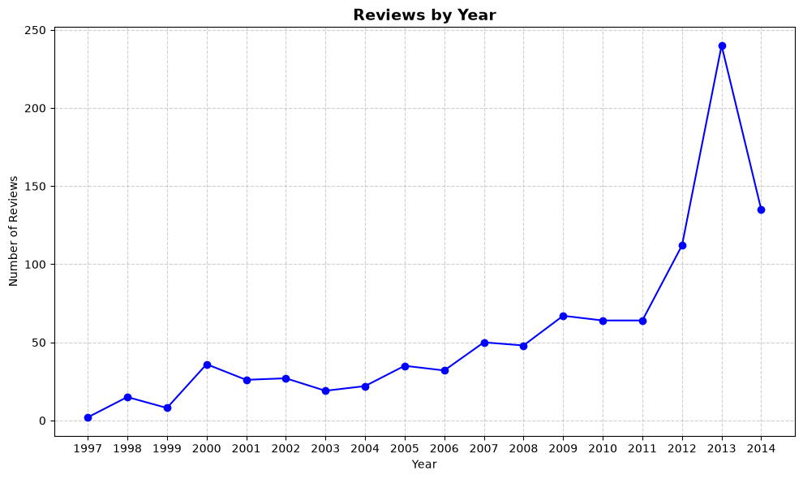

# Data Visualization

## 1. Overview

This directory contains three sample datasets from the Amazon Books review
domain. They can be used together to analyze books, users, ratings, review
content, and review activity over time.

| Dataset        | File                          | Records | Primary key          |
| -------------- | ----------------------------- | ------: | -------------------- |
| Reviews Books  | `reviews_Books_5_sample.json` |   1,000 | `reviewerID`, `asin` |
| Metadata Books | `meta_Books_sample.json`      |   1,000 | `asin`               |
| Ratings Books  | `ratings_Books_sample.csv`    |   1,002 | `reviewerID`, `asin` |

All three datasets were loaded successfully. The `Reviews Books` and
`Ratings Books` datasets identify a user-book interaction with the pair
`reviewerID` and `asin`; `asin` links those interactions to book metadata.

My data is taken from:  
[https://mcauleylab.ucsd.edu/public_datasets/data/amazon/datasets.html](https://mcauleylab.ucsd.edu/public_datasets/data/amazon/datasets.html)

- **Review books**: [http://snap.stanford.edu/data/amazon/productGraph/categoryFiles/reviews_Books_5.json.gz](http://snap.stanford.edu/data/amazon/productGraph/categoryFiles/reviews_Books_5.json.gz)  
- **Metadata books**: [https://mcauleylab.ucsd.edu/public_datasets/data/amazon_v2/metaFiles2/meta_Books.json.gz](https://mcauleylab.ucsd.edu/public_datasets/data/amazon_v2/metaFiles2/meta_Books.json.gz)  
- **Ratings books**: [http://snap.stanford.edu/data/amazon/productGraph/categoryFiles/ratings_Books.csv](http://snap.stanford.edu/data/amazon/productGraph/categoryFiles/ratings_Books.csv)  

**Note**: The data we analyze is only a sample extracted from the source dataset we provide.

## 2. Data Structure

## 2. Data Structure

### 2.1. Reviews Books

- This is user review books on Amazon.

| Name             | Data Type       | Description                                                                                              | Example                                                                                   | Note                                                                                                           |
| ---------------- | --------------- | -------------------------------------------------------------------------------------------------------- | ----------------------------------------------------------------------------------------- | -------------------------------------------------------------------------------------------------------------- |
| `reviewerID`     | `str`           | Unique identifier of the user who wrote the review.                                                      | `"A10000012B7CGYKOMPQ4L"`                                                                 | Used to identify reviewers. One user may write reviews for multiple books.                                     |
| `asin`           | `str`           | Amazon Standard Identification Number (ASIN) identifying the book/product.                               | `"000100039X"`                                                                            | Can be used to link reviews with the corresponding book in the Metadata dataset.                               |
| `reviewerName`   | `str`           | Display name of the reviewer.                                                                            | `"Adam"`                                                                                  | This is the reviewer's name as provided in the dataset.                                                        |
| `helpful`        | `object (list)` | Number of users who marked the review as helpful and the total number of users who voted on helpfulness. | `[0, 0]`                                                                                  | Typically represented as `[helpful_votes, total_votes]`.                                                       |
| `reviewText`     | `str`           | Full textual content of the review written by the reviewer.                                              | `"Spiritually and mentally inspiring! A book that allows you to question your morals..."` | Main textual field for sentiment analysis, text mining, or NLP tasks.                                          |
| `overall`        | `int64`         | Numerical rating given by the reviewer to the book.                                                      | `5`                                                                                       | Usually ranges from 1 to 5 stars.                                                                              |
| `summary`        | `str`           | Short title or summary written by the reviewer for the review.                                           | `"Wonderful!"`                                                                            | Provides a concise description of the reviewer's opinion.                                                      |
| `unixReviewTime` | `int64`         | Timestamp representing the time when the review was submitted, stored as Unix time.                      | `1355616000`                                                                              | Can be converted to a standard date/time format.                                                               |
| `reviewTime`     | `str`           | Human-readable date when the review was submitted.                                                       | `"12 16, 2012"`                                                                           | String representation of the review date. `unixReviewTime` is generally more suitable for date-based analysis. |

---

### 2.2. Metadata Books

| Name              | Data Type       | Description                                                                            | Example                                                                        | Note                                                                                              |
| ----------------- | --------------- | -------------------------------------------------------------------------------------- | ------------------------------------------------------------------------------ | ------------------------------------------------------------------------------------------------- |
| `category`        | `object (list)` | List of categories or classification labels associated with the book.                  | `[]`                                                                           | May be empty when category information is unavailable.                                            |
| `tech1`           | `str`           | Technical or product-related information associated with the book.                     | `""`                                                                           | Often empty for books; availability depends on the original Amazon metadata.                      |
| `description`     | `object (list)` | Textual description of the book/product.                                               | `["It is a biology book with God's perspective."]`                             | Stored as a list and may contain one or multiple description entries.                             |
| `fit`             | `str`           | Product fit information.                                                               | `""`                                                                           | More relevant to physical products such as clothing; generally empty or not meaningful for books. |
| `title`           | `str`           | Full title of the book.                                                                | `"Biology Gods Living Creation Third Edition 10 (A Beka Book Science Series)"` | Important field for identifying and describing the book.                                          |
| `also_buy`        | `object (list)` | List of ASINs of products that customers may also buy with this book.                  | `["0669009075", "B000K2P5SA", "B00MD4G2N0"]`                                   | Contains references to other Amazon products/books.                                               |
| `tech2`           | `str`           | Additional technical or product-related information.                                   | `""`                                                                           | Usually empty for books.                                                                          |
| `brand`           | `str`           | Brand, publisher, author, or other entity associated with the product in the metadata. | `"Keith Graham"`                                                               | The meaning can vary depending on the original Amazon metadata.                                   |
| `feature`         | `object (list)` | List of product features or highlighted characteristics.                               | `[]`                                                                           | Often empty for books.                                                                            |
| `rank`            | `str`           | Amazon sales rank information for the book/product.                                    | `"1,349,781 in Books ("`                                                       | Stored as text and may contain additional category information.                                   |
| `also_view`       | `object (list)` | List of ASINs of products that customers also viewed.                                  | `["0019777701", "B000AUCX7I", "B000K2P5SA"]`                                   | Contains references to other products/books.                                                      |
| `main_cat`        | `str`           | Main product category assigned to the item.                                            | `"Books"`                                                                      | Indicates the main category of the product.                                                       |
| `similar_item`    | `str`           | Information about similar items recommended by Amazon.                                 | `""`                                                                           | May be empty when no information is available.                                                    |
| `date`            | `datetime64[s]` | Date associated with the product metadata.                                             | `NaT`                                                                          | In the provided dataset, all 1,000 records have missing values for this field.                    |
| `price`           | `str`           | Listed price of the book/product.                                                      | `"$39.94"`                                                                     | Stored as a string because it contains the currency symbol.                                       |
| `asin`            | `str`           | Amazon Standard Identification Number (ASIN) identifying the book/product.             | `"0000092878"`                                                                 | Primary field for linking metadata with reviews and ratings.                                      |
| `imageURL`        | `object (list)` | List of URLs pointing to product/book images.                                          | `[]`                                                                           | May be empty when images are unavailable.                                                         |
| `imageURLHighRes` | `object (list)` | List of URLs pointing to high-resolution product/book images.                          | `[]`                                                                           | May be empty when high-resolution images are unavailable.                                         |

---

### 2.3. Ratings Books

| Name             | Data Type | Description                                                                      | Example           | Note                                                                    |
| ---------------- | --------- | -------------------------------------------------------------------------------- | ----------------- | ----------------------------------------------------------------------- |
| `reviewerID`     | `str`     | Unique identifier of the user who gave the rating.                               | `"AH2L9G3DQHHAJ"` | Can be used to identify the user associated with a rating.              |
| `asin`           | `str`     | Amazon Standard Identification Number (ASIN) identifying the rated book/product. | `"0000000116"`    | Can be used to link the rating with the corresponding book in Metadata. |
| `overall`        | `float64` | Numerical rating assigned by the user to the book.                               | `4.0`             | Represents the user's rating, typically on a 1–5 scale.                 |
| `unixReviewTime` | `int64`   | Unix timestamp indicating when the rating/review was created.                    | `1019865600`      | Can be converted into a human-readable date/time.                       |

---

## 3. Data Quality and Relationships

### 3.1. Completeness

| Dataset        | Columns | Non-null values | Null values |
| -------------- | ------: | --------------: | ----------: |
| Reviews Books  |       9 |           9,000 |           0 |
| Metadata Books |      18 |          17,000 |       1,000 |
| Ratings Books  |       4 |           4,008 |           0 |

The only missing field is `Metadata Books.date`, which is null for all 1,000
records. The sample contains 12 unique books in the reviews data and 996
unique reviewers.

### 3.2. Keys and cardinality

- `Reviews Books`: (`reviewerID`, `asin`) is unique; 0 duplicate keys.
- `Metadata Books`: `asin` is unique; 0 duplicate keys.
- `Ratings Books`: (`reviewerID`, `asin`) is unique; 0 duplicate keys.
- Metadata to reviews: `asin` has a 1:N relationship.
- Reviews to ratings: (`reviewerID`, `asin`) has a 1:1 relationship in this
  sample. Each individual `reviewerID` or `asin` can occur in multiple rows.

## 4. Exploratory Analysis

### 4.1. Users

- Unique users: **996**.
- Maximum reviews by one user: **2**.
- Users with exactly one review: **992**.
- Four users have the maximum of two reviews.

This indicates that the sample is highly sparse at the user level: almost all
users appear only once.

### 4.2. Books

- Unique books in reviews: **12**.
- Maximum reviews for one book: **685** (`0002007770`).
- Minimum reviews for one book: **5** (`0002006715`).
- Books with exactly one review: **0**.

The review sample is strongly concentrated on a small number of books, with
`0002007770` accounting for most review records.

### 4.3. Rating distribution

|    Rating |   Reviews |  Percentage |
| --------: | --------: | ----------: |
|         1 |        40 |       3.99% |
|         2 |        27 |       2.69% |
|         3 |        48 |       4.79% |
|         4 |       105 |      10.48% |
|         5 |       782 |      78.04% |
| **Total** | **1,002** | **100.00%** |

- Minimum rating: **1.0**.
- Maximum rating: **5.0**.
- Mean rating: **4.56**.
- Median rating: **5.0**.

The ratings are positively skewed: 5-star ratings represent approximately
78% of all rating records.

### 4.4. Review trend by year

| Year | Reviews | Percentage |
| ---: | ------: | ---------: |
| 1997 |       2 |      0.20% |
| 1998 |      15 |      1.50% |
| 1999 |       8 |      0.80% |
| 2000 |      36 |      3.59% |
| 2001 |      26 |      2.59% |
| 2002 |      27 |      2.69% |
| 2003 |      19 |      1.90% |
| 2004 |      22 |      2.20% |
| 2005 |      35 |      3.49% |
| 2006 |      32 |      3.19% |
| 2007 |      50 |      4.99% |
| 2008 |      48 |      4.79% |
| 2009 |      67 |      6.69% |
| 2010 |      64 |      6.39% |
| 2011 |      64 |      6.39% |
| 2012 |     112 |     11.18% |
| 2013 |     240 |     23.95% |
| 2014 |     135 |     13.47% |

The review period spans **1997-2014**, with **2013** as the peak year at 240
reviews (23.95% of the sample).

## 5. Usage Notes

- Use `asin` to join reviews and ratings with `Metadata Books`.
- Use (`reviewerID`, `asin`) when joining a specific user-book interaction.
- Convert `unixReviewTime` to a datetime for time-series analysis.
- Treat `helpful` as a two-element list in the form
  `[helpful_votes, total_votes]`.
- `Metadata Books.date` is entirely missing in this sample, so it should not
  be used for date-based analysis without another source.
